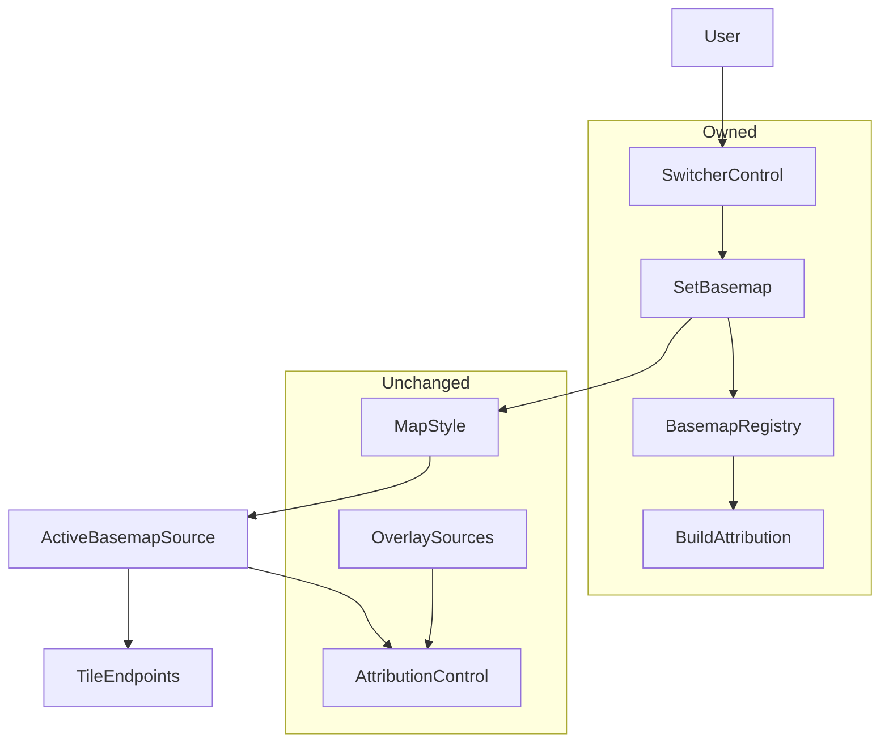
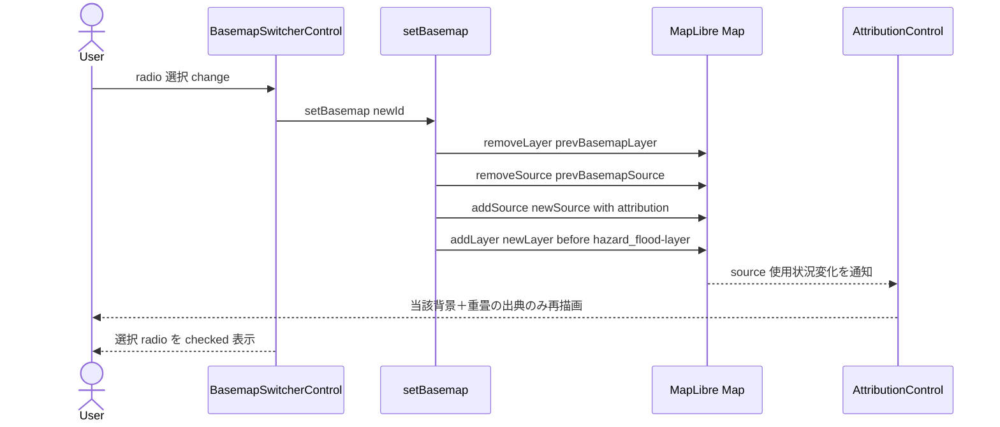
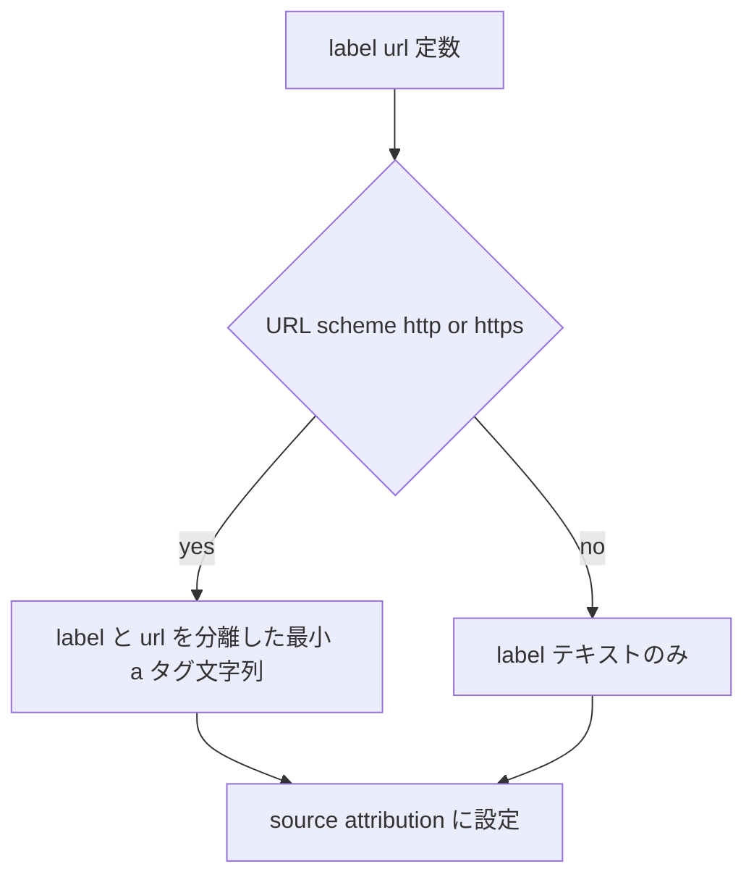

# Technical Design

## Overview

**Purpose**: 防災ハザードマップ PWA の利用者に、背景地図を OSM・地理院地図(標準)・航空写真・白地図から選べる手段を提供する。地図左下に切替コントロールを設け、選択に応じて背景タイルと出典表記を追従させる。

**Users**: 一般利用者が、地形把握・現況確認・ハザード重畳の視認性に応じて背景を選び替える。キーボード／支援技術利用者も同等に操作できる。

**Impact**: 現状 `osm` 1 種固定の背景地図を、単一ファイル `main.js` のスタイル定義と命令的 API の範囲で「排他選択可能な背景地図群＋背景に追従する出典」に拡張する。重畳レイヤ（ハザード・指定緊急避難場所）、現在地ナビ、3D 地形、PWA の挙動は不変。本リポジトリの主目的（SDD 新規機能フローの検証）に沿い、最小差分・既存パターン踏襲で実装する。

### Goals
- 地図左下のコントロールから 4 種背景地図を排他選択でき、再読み込みなしで即時反映する。
- 表示中の背景地図に対応した出典のみを表示し、切替で旧出典を残さない。重畳レイヤの出典は維持する。
- 出典を信頼定数のみから安全に構築し、新たな出力経路リスク（XSS）を生まない。
- 既存機能・既存コントロールに回帰を出さない。

### Non-Goals
- 選択状態の永続化（リロード後保持）。
- 任意 URL のカスタム背景地図追加 UI。
- 4 種以外の GSI レイヤ（淡色地図等）の追加、背景地図の不透明度調整。
- 既存 OpacityControl（ハザード／skhb）の挙動・配置変更、既存 Popup の生 HTML 描画（別課題）の是正。

## Boundary Commitments

### This Spec Owns
- 背景地図切替コントロール（IControl）の UI と地図左下への配置。
- 背景地図レジストリ（4 種の source 定義・ズーム/形式差・出典メタデータ）。
- 背景地図の切替ロジック（アクティブ背景の source/layer の単一性、最下レイヤ順序の維持）。
- 背景地図出典の安全な構築（型付き定数からのビルド・スキーム検証）。

### Out of Boundary
- 重畳レイヤ（hazard_*／skhb／route／hillshade）の定義・可視・不透明度・出典そのもの（背景切替に対し不変であることのみを保証）。
- 既定 AttributionControl の生成・位置（MapLibre 既定のまま。本設計は集約対象ソースを変えるのみ）。
- 永続化・カスタム地図追加・既存 Popup XSS 是正（別スコープ）。

### Allowed Dependencies
- `maplibre-gl` 5.24.0（Map / IControl / addSource / removeSource / addLayer / removeLayer / 既定 AttributionControl）。
- GSI 公開タイル（std / seamlessphoto / blank）と OSM 公開タイル。申請不要・CORS 開放を前提（`research.md` 検証済）。
- 既存 `main.js` のスタイル定義・`map.on('load')` 登録順、既存 `style.css`（アプリ級 override）。
- 制約: 新ファイルを作らない（structure.md 単一ファイル方針）。重畳レイヤの定義・順序を背景切替で破壊しない。出典に利用者入力・外部由来データを補間しない（security.md）。

### Revalidation Triggers
- 背景レイヤ挿入の基準レイヤ（`hazard_flood-layer`）の ID・存在前提が変わる改修。
- 既定 AttributionControl の無効化・位置変更・別出典機構の導入。
- 背景地図レジストリの出典メタデータ形（`{label,url}`）や `setBasemap` 契約の変更。
- maplibre-gl のメジャー更新（IControl／AttributionControl 集約挙動の互換性）。

## Architecture

### Existing Architecture Analysis
- **構成**: 単一 `main.js` に Map 構築（Style Spec v8 をインライン定義＝設定 as データ）＋命令的 API。`osm` source と最下 `osm-layer`、続いて `hazard_*-layer`（先頭 `hazard_flood-layer`、常駐・visibility:none）、`route`、`skhb-*`。`map.on('load')` で OpacityControl×2（左上/右上）、Geolocate/Terrain（右下）、`hillshade` を登録。
- **既定 AttributionControl**: Map options に `attributionControl` 指定なし＝MapLibre が既定 AttributionControl を自動生成（右下）。**使用中（used）ソースの `attribution` のみ**集約し、`DOM.sanitize`（DOMPurify, v5）を通して innerHTML 反映。`metadata`/`visibility`/`style` 系イベントで自動再描画。
- **維持すべき統合点**: 重畳・skhb・route・hillshade のレイヤ順序と可視、各 source の `attribution`。Geolocate/Terrain と OpacityControl の位置。
- **作り込まず利用する技術的特性**: 「使用中ソースのみ集約」を利用し、背景ソースを単一に保つことで出典が自動追従する（自前出典描画を回避）。

### Architecture Pattern & Boundary Map



**Architecture Integration**:
- **Selected pattern**: 設定 as データ（背景地図レジストリ）＋ 命令的切替（単一アクティブ source/layer の add/remove）＋ ネイティブ出典集約。
- **Domain/feature boundaries**: 切替 UI・レジストリ・切替ロジック・出典ビルダのみを所有。重畳・既定 AttributionControl は不変領域として参照のみ。
- **Existing patterns preserved**: ドメイン接頭辞付きソース/レイヤ ID、本体＋CSS のペア import、`map.on('load')` 登録、新ファイル非作成。
- **New components rationale**: `BasemapSwitcherControl`（左下排他 UI が既存手段に無い）、`BASEMAPS`（4 種定義の単一情報源）、`setBasemap`（順序・単一性を保証する切替）、`buildAttribution`（Req 4 の安全構築）。
- **Steering compliance**: structure.md（単一ファイル・設定 as データ）、security.md（ラベル/URL 分離・http(s) allow-list・markup 非解釈）、tech.md（バニラ JS・二段検証）。

### Technology Stack

| Layer | Choice / Version | Role in Feature | Notes |
|-------|------------------|-----------------|-------|
| Frontend / CLI | maplibre-gl 5.24.0 | Map・IControl・add/removeSource/Layer・既定 AttributionControl 集約 | 既存依存、新規追加なし |
| Frontend / CLI | バニラ JS (ES Modules) | `BasemapSwitcherControl`／`BASEMAPS`／`setBasemap`／`buildAttribution` を `main.js` に内包 | TS 不使用、契約は JSDoc typedef で表現 |
| Data / Storage | GSI 公開タイル（std/seamlessphoto/blank）, OSM タイル | 背景地図ラスタソース | 申請不要・CORS `*`・API キー不要 |
| Infrastructure / Runtime | 既存 `style.css`（アプリ級 override） | 切替コントロールの最小スタイル | 新ファイル無し |

新規 npm 依存はゼロ。逸脱なし（既存スタックの範囲内）。

## File Structure Plan

新規ファイルは作らない（structure.md 単一ファイル方針）。すべて既存ファイルへの追記・改修。

### Modified Files
- `main.js` — 以下を追加/改修（1 ファイル内、既存パターンに追加）:
  - `BASEMAPS` レジストリ定数（4 種の id・label・source 定義・出典 `{label,url}`・ズーム/形式）。
  - `buildAttribution({label,url})` — http(s) スキーム検証後に最小 `<a>` 文字列を返す安全ビルダ（fail-closed）。
  - `BASEMAPS` の出典を `buildAttribution` 経由で各 source `attribution` に設定。
  - 初期 style の `osm` source/`osm-layer` を `BASEMAPS` の OSM エントリと一貫させる（既定＝OSM、Req 1.6）。
  - `setBasemap(id)` — 現背景 layer/source を remove → 選択 source を add → `addLayer(layer,'hazard_flood-layer')` で最下に add。
  - `BasemapSwitcherControl`（IControl）クラス定義と `map.addControl(new BasemapSwitcherControl(), 'bottom-left')`（`map.on('load')` 内、既存 addControl 群と同所）。
- `style.css` — `BasemapSwitcherControl` 用の最小スタイル（既存コントロールと調和、重なり回避）。

> 各責務は単一。`index.html`・`public/*`・ビルド設定は不変。

## System Flows

### 背景地図切替シーケンス



切替は再読み込みなし（Req 1.4）。背景は常に 1 source/layer のみ存在（Req 1.3／3.3）。`beforeId` 固定で最下順序を維持（Req 5.4）。重畳・skhb・route・hillshade・既定コントロールは未変更（Req 5.1–5.5）。

### 出典安全構築（状態）



入力は開発者定数のみ。利用者入力・外部データを補間しない（Req 4.1/4.2）。スキーム非適合は fail-closed でラベルのみ（Req 4.3）。MapLibre v5 の DOMPurify サニタイズと併せ多層防御（Req 4.4）。

## Requirements Traceability

| Requirement | Summary | Components | Interfaces | Flows |
|-------------|---------|------------|------------|-------|
| 1.1 | 左下にコントロール表示 | BasemapSwitcherControl | onAdd / getDefaultPosition | 切替シーケンス |
| 1.2 | 4 種を日本語ラベルで提示 | BASEMAPS, BasemapSwitcherControl | BASEMAPS[].label | - |
| 1.3 | 排他選択（選択のみ表示） | setBasemap | setBasemap(id) | 切替シーケンス |
| 1.4 | 再読み込みなし即時反映 | setBasemap | add/removeSource/Layer | 切替シーケンス |
| 1.5 | 現在選択の明示 | BasemapSwitcherControl | radio checked | 切替シーケンス |
| 1.6 | 初期＝OSM・現行挙動維持 | BASEMAPS, main.js init | 初期 style osm エントリ | - |
| 2.1 | 航空写真を形式差なく表示 | BASEMAPS | source tiles `.jpg` | - |
| 2.2 | 白地図 z>提供範囲で空白回避 | BASEMAPS | source maxzoom 14 | - |
| 2.3 | 白地図 地域外で操作非破綻 | BASEMAPS, 既存 maxBounds | source minzoom/日本域 | - |
| 2.4 | ズーム/形式差を吸収して表示 | BASEMAPS | per-source minzoom/maxzoom/ext | - |
| 2.5 | タイル失敗で他機能継続 | setBasemap, MapLibre | （MapLibre タイル単位失敗許容） | エラー処理 |
| 3.1 | OSM 選択時 OSM 出典 | BASEMAPS, AttributionControl | source attribution | 出典構築 |
| 3.2 | GSI 選択時 国土地理院出典 | BASEMAPS, buildAttribution | buildAttribution | 出典構築 |
| 3.3 | 切替で旧出典を残さない | setBasemap, AttributionControl | 単一アクティブソース | 切替シーケンス |
| 3.4 | 重畳の出典は維持 | （不変領域）OverlaySources | 既存 source attribution | 切替シーケンス |
| 4.1 | 出典は信頼定数のみ | BASEMAPS, buildAttribution | BASEMAPS[].attribution | 出典構築 |
| 4.2 | 利用者/外部データ非補間 | buildAttribution | buildAttribution 入力 | 出典構築 |
| 4.3 | ラベル/URL 分離・http(s) 限定 | buildAttribution | scheme allow-list | 出典構築 |
| 4.4 | markup 非解釈で出力 | buildAttribution, AttributionControl | DOMPurify ＋ 最小 a | 出典構築 |
| 5.1 | 重畳の表示状態維持 | setBasemap | beforeId 固定・重畳不操作 | 切替シーケンス |
| 5.2 | ナビ/3D 地形維持 | setBasemap | 背景のみ操作 | 切替シーケンス |
| 5.3 | 既存コントロール不変 | （不変領域） | addControl 位置不変 | - |
| 5.4 | 背景は重畳より下 | setBasemap | addLayer beforeId | 切替シーケンス |
| 5.5 | PWA 既存挙動維持 | （不変領域） | public/* 不変 | - |
| 6.1 | キーボードのみで選択可 | BasemapSwitcherControl | ネイティブ radio | - |
| 6.2 | 支援技術ラベル付与 | BasemapSwitcherControl | label for/fieldset legend | - |
| 6.3 | 選択状態を支援技術に提示 | BasemapSwitcherControl | radio checked 状態 | - |
| 6.4 | 地図操作非妨害・非重複配置 | BasemapSwitcherControl, style.css | コンテナ class/最小サイズ | - |

## Components and Interfaces

| Component | Domain/Layer | Intent | Req Coverage | Key Dependencies (P0/P1) | Contracts |
|-----------|--------------|--------|--------------|--------------------------|-----------|
| BASEMAPS | Config (data) | 4 種背景の単一情報源 | 1.2, 1.6, 2.1–2.4, 3.1, 3.2, 4.1 | maplibre-gl source spec (P0) | State |
| buildAttribution | Logic | 出典を安全構築（fail-closed） | 3.2, 4.1–4.4 | BASEMAPS (P0) | Service |
| setBasemap | Logic | 背景の単一性・順序を保つ切替 | 1.3, 1.4, 2.5, 3.3, 5.1, 5.2, 5.4 | maplibre-gl Map (P0), BASEMAPS (P0) | Service |
| BasemapSwitcherControl | UI | 左下排他選択 UI（IControl） | 1.1, 1.2, 1.5, 6.1–6.4 | maplibre-gl IControl (P0), setBasemap (P0) | State |

依存方向: BASEMAPS → buildAttribution → (source attribution) ／ BASEMAPS + setBasemap → Map ／ BasemapSwitcherControl → setBasemap。UI は Logic にのみ依存し、上位（Map イベント）へ逆流しない。

### Config / Logic

#### BASEMAPS（背景地図レジストリ）

| Field | Detail |
|-------|--------|
| Intent | 4 種背景の id・ラベル・source 定義・出典・ズーム/形式の単一情報源 |
| Requirements | 1.2, 1.6, 2.1, 2.2, 2.3, 2.4, 3.1, 3.2, 4.1 |

**Responsibilities & Constraints**
- 各エントリ: `id`（`osm`/`gsi_std`/`gsi_seamlessphoto`/`gsi_blank`）、`label`（日本語）、`source`（MapLibre raster source。`tiles`/`tileSize:256`/`minzoom`/`maxzoom`）、`attribution`（`{label,url}` 型付き定数）。
- ズーム/形式差を吸収: `gsi_seamlessphoto` は `.jpg`、`gsi_blank` は `maxzoom:14`、`gsi_std` `maxzoom:18`、`osm` 既存値踏襲（`maxzoom:19`）。
- 出典は開発者定数のみ。利用者入力・外部由来データを保持しない（Req 4.1）。
- OSM エントリは初期 style の既存 `osm` 定義と一致（既定＝OSM、Req 1.6）。

**Dependencies**
- Outbound: buildAttribution — `attribution` 文字列生成（P0）
- External: maplibre-gl raster source spec（P0）

**Contracts**: State [x]

##### State Management
```js
/**
 * @typedef {Object} BasemapAttribution
 * @property {string} label   表示ラベル（テキスト）
 * @property {string} url     リンク先（http/https のみ許容）
 *
 * @typedef {Object} BasemapDef
 * @property {'osm'|'gsi_std'|'gsi_seamlessphoto'|'gsi_blank'} id
 * @property {string} label   コントロール表示用日本語ラベル
 * @property {object} source  MapLibre raster source 定義（tiles, tileSize, minzoom, maxzoom）
 * @property {BasemapAttribution} attribution
 */
/** @type {ReadonlyArray<BasemapDef>} */
const BASEMAPS = [ /* osm, gsi_std, gsi_seamlessphoto, gsi_blank */ ];
```
- State model: 不変 const 配列。実行時状態は「現アクティブ id」のみ（`setBasemap` が保持）。
- Persistence: なし（Non-Goal）。
- Concurrency: 単一スレッド（ブラウザ）。並行切替は最後の選択が反映。

#### buildAttribution（出典安全ビルダ）

| Field | Detail |
|-------|--------|
| Intent | 型付き定数から http(s) 検証済みの最小 attribution 文字列を生成（fail-closed） |
| Requirements | 3.2, 4.1, 4.2, 4.3, 4.4 |

**Responsibilities & Constraints**
- 入力は `BasemapAttribution`（開発者定数）のみ。利用者入力・外部データを引数に取らない/補間しない（Req 4.2）。
- `new URL(url, location.href).protocol` が `/^https?:$/` に適合する場合のみ `<a href="<url>" target="_blank" rel="noopener">` ＋ ラベルを返す。非適合はラベルのみ（fail-closed, Req 4.3）。
- ラベルは markup を含まない前提のテキスト定数。MapLibre v5 の `DOM.sanitize`（DOMPurify）が二次防御（Req 4.4）。

**Dependencies**
- Inbound: BASEMAPS — `attribution` メタデータ（P0）

**Contracts**: Service [x]

##### Service Interface
```js
/**
 * @param {BasemapAttribution} attr  開発者定義の信頼定数
 * @returns {string} MapLibre source.attribution へ渡す文字列
 */
function buildAttribution(attr) // → http(s) なら最小<a>、不適合ならlabelのみ
```
- Preconditions: `attr` は `BASEMAPS` 由来の定数。外部/利用者値を渡さない。
- Postconditions: 返り値は開発者統制下の文字列のみ。`javascript:` 等のスキームは `<a>` 化されない。
- Invariants: 入力源が定数である限り XSS ベクタを生成しない。

#### setBasemap（背景切替ロジック）

| Field | Detail |
|-------|--------|
| Intent | アクティブ背景を単一に保ち、最下レイヤ順序を維持して切替 |
| Requirements | 1.3, 1.4, 2.5, 3.3, 5.1, 5.2, 5.4 |

**Responsibilities & Constraints**
- 現アクティブ背景の layer→source を remove、選択 `BasemapDef.source` を addSource、`addLayer({id, source, type:'raster'}, 'hazard_flood-layer')` で最下挿入（Req 5.4）。
- 同一 id 選択は no-op（不要な再生成回避）。背景以外（hazard/skhb/route/hillshade/コントロール）に一切触れない（Req 5.1, 5.2）。
- `attribution` は source 定義に内包されるため、未使用ソース除去で AttributionControl が自動更新（Req 3.3）。
- タイル取得失敗は MapLibre がタイル単位で許容＝致命化しない。本関数に追加処理不要（Req 2.5）。

**Dependencies**
- Inbound: BasemapSwitcherControl — 選択 id（P0）
- Outbound: maplibre-gl Map（add/removeSource/Layer）（P0）, BASEMAPS（P0）

**Contracts**: Service [x]

##### Service Interface
```js
/**
 * @param {BasemapDef['id']} id  選択された背景地図 id
 * @returns {void}
 */
function setBasemap(id)
```
- Preconditions: `id` は `BASEMAPS` のいずれか。Map は load 済み。`hazard_flood-layer` が存在（初期 style 常駐）。
- Postconditions: 背景は選択 1 種のみ存在し最下。出典は当該背景＋重畳のみ。重畳・skhb・route・hillshade 不変。
- Invariants: 背景 source/layer は常に 0 または 1（過渡的に remove→add の順）。

### UI

#### BasemapSwitcherControl

| Field | Detail |
|-------|--------|
| Intent | 地図左下の背景地図排他選択 UI（MapLibre IControl） |
| Requirements | 1.1, 1.2, 1.5, 6.1, 6.2, 6.3, 6.4 |

**Responsibilities & Constraints**
- `onAdd(map)`: `div.maplibregl-ctrl.maplibregl-ctrl-group` 内に `<fieldset>`＋`<legend>`（支援技術用見出し）＋ `name="basemap"` の `<input type="radio" id>`＋`<label for>` を `BASEMAPS` 件数ぶん生成。既定 id を checked（OSM、Req 1.6/1.5）。
- `change` で `setBasemap(selectedId)` を呼ぶ。`onRemove()` でリスナ解放・DOM 除去。
- `getDefaultPosition()` は `'bottom-left'`（`addControl` 第2引数 `'bottom-left'` でも明示）。
- ネイティブ radio によりキーボード操作・支援技術ラベル・選択状態提示を標準充足（Req 6.1–6.3）。
- 既存コントロール（左上/右上/右下）と重ならない最小サイズ・配置（`style.css`、Req 6.4）。

**Dependencies**
- Inbound: map.addControl（P0）
- Outbound: setBasemap（P0）, BASEMAPS（P0, ラベル/既定）
- External: maplibre-gl IControl（P0）

**Contracts**: State [x]

##### State Management
- State model: 選択中 id（DOM の checked radio が唯一の真実）。内部に重複状態を持たない。
- Persistence: なし。
- Concurrency: 単一。`onRemove` で確実にリスナ解放（リーク防止）。

**Implementation Notes**
- Integration: `map.on('load')` 内、既存 `addControl` 群と同所で `map.addControl(new BasemapSwitcherControl(), 'bottom-left')`。
- Validation: 実機スモークでキーボード操作・読み上げ・既存コントロール非重複を目視（tech.md 二段検証、UI は静的解析で断定しない）。
- Risks: レイヤ順序・出典残留は `setBasemap` の `beforeId` 固定＋単一アクティブ方式で対処（research.md R1/R2）。

## Error Handling

### Error Strategy
- **タイル取得失敗（Req 2.5）**: MapLibre はタイル単位で失敗を許容し地図全体を停止しない。`setBasemap` は追加のエラーハンドリングを持たず、重畳/ナビ等は継続。設計上の非致命を明示。
- **ズーム/地域範囲外（Req 2.2/2.3）**: `gsi_blank` は `maxzoom:14` で overzoom（最深タイル引き伸ばし）、既存 `maxBounds`（日本域）で地域外を抑止。空白埋め尽くし・操作破綻を回避。
- **不正出典 URL（Req 4.3）**: `buildAttribution` が fail-closed でラベルのみ返却。`<a>` を生成しない。
- **無効 id（防御的）**: `setBasemap` で `BASEMAPS` に無い id は no-op（既存背景維持）。

### Monitoring
- サーバ/テレメトリ無し（security.md）。実機デバッグ用一時 `console` ログは検証完了後に必ず除去。座標・利用者データを残さない。

## Testing Strategy

自動テスト基盤は無いため、tech.md の二段（クリーン環境 build/dev/preview ＋ 実機スモークチェックリスト）で受け入れ基準を検証する。build グリーン単独を合格としない。

### 機能スモーク（実機・受け入れ基準対応）
- 左下にコントロールが表示され 4 種日本語ラベルが見える（1.1, 1.2）。
- OSM→地理院標準→航空写真→白地図 を順に選択し、各々背景が即時に切替わり選択 radio が checked 表示（1.3, 1.4, 1.5）。
- 初期表示が OSM で、従来の初期中心/ズーム/操作が不変（1.6）。
- 航空写真が欠落なく表示（`.jpg`）、白地図で z14 超ズーム時に空白で埋め尽くされず操作可能、日本域外で操作非破綻（2.1, 2.2, 2.3, 2.4）。
- 任意背景でタイルが一部失敗しても重畳・現在地ナビが継続（2.5）。

### 出典スモーク（受け入れ基準対応）
- OSM 表示時に OpenStreetMap 出典＋リンク、GSI 各種で「出典：国土地理院ウェブサイト」＋ GSI リンクが表示（3.1, 3.2）。
- OSM↔GSI を往復し、切替前の背景出典が残らない（3.3）。
- 背景切替後もハザード/skhb 出典が継続表示（3.4）。
- `buildAttribution` に不正スキーム url を与えるとラベルのみ（手動確認、4.3）。出典 DOM に未エスケープ markup が注入されない（4.4）。

### 非回帰スモーク（受け入れ基準対応）
- 背景切替の前後でハザード/skhb の選択・可視・不透明度、現在地ナビ・経路ライン・3D 地形/陰影が不変（5.1, 5.2）。
- OpacityControl（左上/右上）・Geolocate/Terrain（右下）の位置・挙動不変、背景が重畳の上に被らない（5.3, 5.4）。
- PWA インストール/オフライン挙動不変（5.5）。

### アクセシビリティスモーク（受け入れ基準対応）
- Tab/矢印キーのみで 4 種を選択可（6.1）。スクリーンリーダで各選択肢ラベルと選択状態が読み上げられる（6.2, 6.3）。コントロールが地図操作を妨げず既存コントロールと重ならない（6.4）。

## Security Considerations
- **脅威**: 出典の innerHTML 経路（既定 AttributionControl）への未信頼データ混入＝DOM/XSS（security.md 主リスク）。
- **対策**: 入力源を `BASEMAPS` の開発者定数のみに限定（Req 4.1/4.2）。`buildAttribution` でラベルと URL を分離し、`http`/`https` スキーム allow-list を満たす場合のみ `<a>` を構成、非適合は fail-closed でラベルのみ（Req 4.3）。MapLibre v5 の `DOM.sanitize`（DOMPurify）を二次防御として併用（Req 4.4）。`rel="noopener"` を付与。
- **非導入**: 認証・秘匿情報・バックエンド・テレメトリは追加しない（security.md 方針、Non-Goal）。位置情報の扱いは変更しない。
- spec 003 で確立した「ラベル/URL 分離・エスケープ・スキーム検証」パターンの継承であり、新たな出力経路リスクを導入しない。
