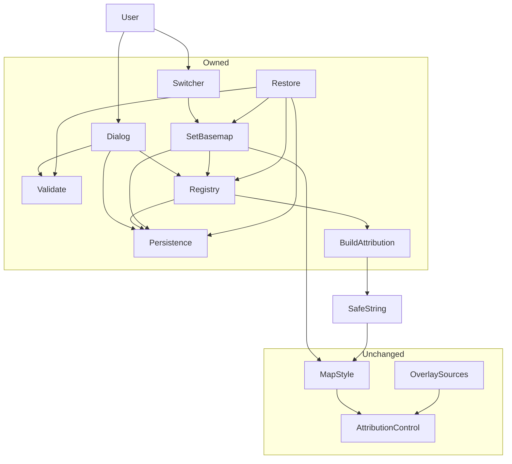
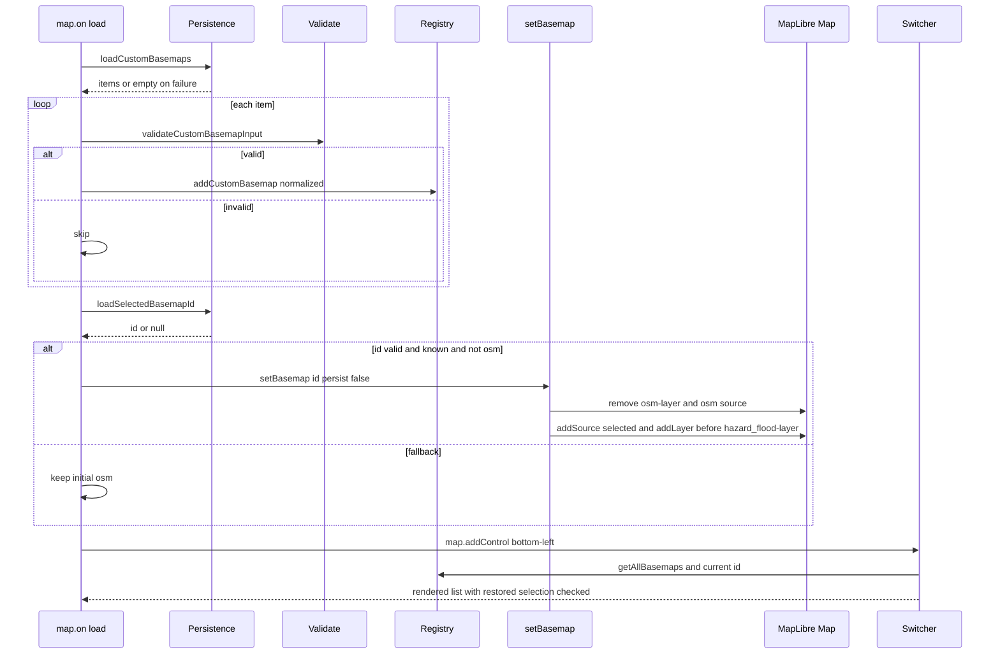
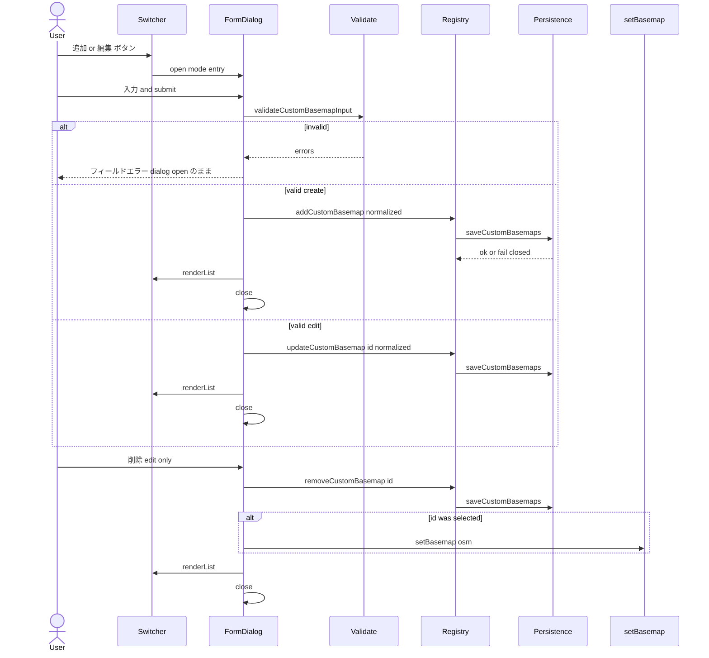
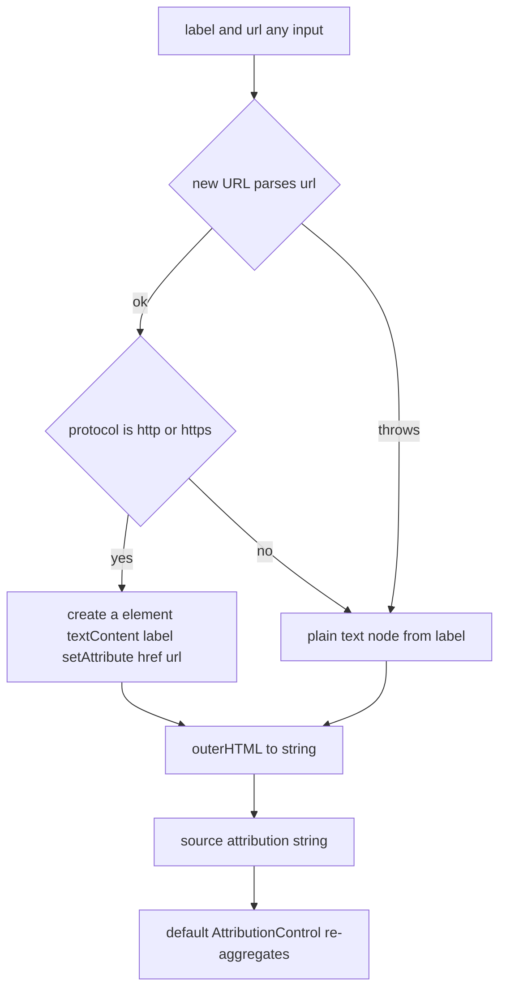
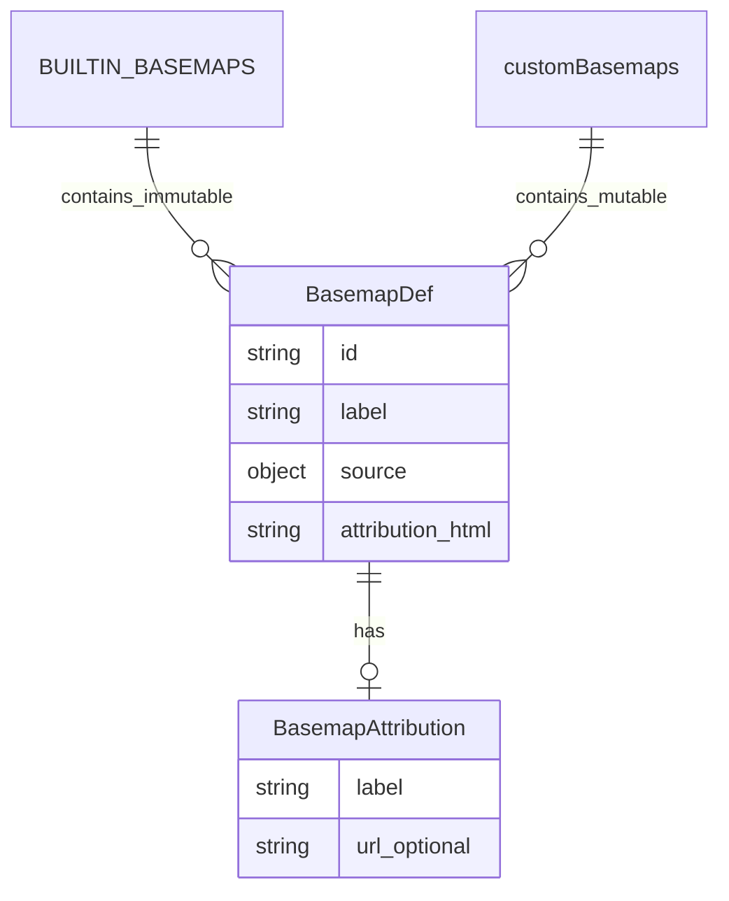

# Technical Design

## Overview

**Purpose**: 防災ハザードマップ PWA の利用者に、組込み 4 種の背景地図に加え、任意の XYZ ラスタタイルを自分で追加・編集・削除でき、追加した背景地図と最後に選択した背景地図がリロード後も保たれる手段を提供する。第1段（実装・受け入れ済み）の左下排他選択 UI と出典追従を非回帰で保持しつつ、利用者入力と永続化値を新たな信頼境界として安全に取り扱う。

**Users**: 一般利用者は組込み 4 種に加え、業務固有の参考タイル（自治体公開タイル等）を追加して防災情報を重ねて確認する。キーボード／支援技術利用者も同等に追加・選択・編集・削除できる。

**Impact**: `main.js` の背景地図レジストリを「組込み（不変）＋利用者（可変・永続）」の二層に拡張し、`setBasemap` の対象を全レジストリに広げる。既存 `buildAttribution` の文字列生補間（属性ブレイクアウト・ラベル markup の余地あり）を DOM API ベースの安全文字列ビルダへ作り替え、信頼定数・利用者入力のいずれにも安全。新たに永続化ヘルパ（`localStorage`）と入力検証ヘルパ、起動時復元シーケンス、ネイティブ `<dialog>` の入力フォームを追加する。重畳レイヤ（hazard_*／skhb／route／hillshade）、現在地ナビ、3D 地形、PWA、既存コントロールの位置・挙動は不変。

### Goals
- 一覧末尾の追加操作から任意の XYZ ラスタ背景地図を追加し、組込みと等価に排他選択・出典追従・非回帰の対象にできる。
- 追加した背景地図および最後に選択していた背景地図をブラウザ内に永続化し、復元時に未信頼として再検証する。復元不能は OSM フォールバック。
- 既存 `buildAttribution` の生補間（属性ブレイクアウト／ラベル markup の余地）を是正し、信頼／未信頼いずれの入力でも安全な文字列を生成する。
- 受け入れ済み Req 1–6 の挙動を非回帰で保持しつつ、Req 1.6（初回 OSM）の意味を「永続化選択なき初回」へ意図的に縮める。

### Non-Goals
- XYZ ラスタ以外のタイル種別（WMTS／TMS／ベクトル）対応、4 種以外の GSI レイヤの組込み追加、背景の不透明度調整、組込み 4 種の編集／削除、追加前のタイル到達性事前検証、既存 OpacityControl の挙動・配置変更、既存 Popup の生 HTML 描画の是正（別課題）。

## Boundary Commitments

### This Spec Owns
- 組込み背景地図レジストリ（不変）と利用者背景地図レジストリ（可変・永続）の二層モデルおよび結合ビュー。
- 背景地図切替コントロール（IControl）— 組込み＋利用者を一覧表示し、末尾に追加操作・利用者エントリの編集ボタンを提示。
- 背景地図入力フォーム（ネイティブ `<dialog>`）— 追加／編集／削除の単一 UI。
- 背景地図定義の入力検証（必須、`{z}{x}{y}`、`https:` のみ、ズーム）と利用者入力に対する安全な出典文字列構築。
- 背景地図定義および「最後に選択した背景地図 id」のブラウザ内永続化、復元時の未信頼再検証、保存失敗フェイルクローズ。
- 起動時復元シーケンス（`map.on('load')` 内、`addControl(BasemapSwitcherControl)` 前）。
- 背景地図の切替・順序保証（`setBasemap`／`hazard_flood-layer` 直下挿入）— 組込み／利用者を等価に扱う。

### Out of Boundary
- 重畳レイヤ（hazard_*／skhb／route／hillshade）の定義・順序・可視・不透明度・出典そのもの（背景切替・追加・編集・削除に対し不変であることのみを保証）。
- MapLibre 既定 AttributionControl の生成・位置（本設計は集約対象 `source.attribution` の内容を変えるのみ。サニタイザ実装は MapLibre 側の責務で、唯一の防御として依存しない）。
- 既存 Popup の生 HTML 描画（別課題、本スコープで修正しない）。
- 認証・秘匿情報・バックエンド・テレメトリ（security.md 方針）。
- WMTS／TMS／ベクトルタイル・タイル到達性事前検証・組込み 4 種の編集削除（Non-Goal）。

### Allowed Dependencies
- `maplibre-gl` 5.24.0（Map／IControl／add/removeSource／add/removeLayer／既定 AttributionControl／`map.on('load')`）。
- プラットフォームネイティブ: `window.localStorage`、HTML `<dialog>` 要素、`crypto.randomUUID()`、`new URL()`、`document.createElement` + `.textContent` + `.setAttribute`。
- 公開タイル（OSM／GSI std/seamlessphoto/blank）— 既存。利用者追加タイルは利用者責任の任意 https エンドポイント。
- 既存 `main.js` のスタイル定義・`map.on('load')` 登録順、既存 `style.css`。
- **制約**: 新ファイルを作らない（structure.md 単一ファイル方針）。重畳順序を破壊しない。利用者入力・永続化値を innerHTML 経路へ生で渡さない（security.md ／ MapLibre v5 サニタイザは弱いブロックリストで唯一の防御に不適格）。新規 npm 依存ゼロ。

### Revalidation Triggers
- `hazard_flood-layer` の id・存在前提が変わる改修（背景挿入の `beforeId`）。
- 既定 AttributionControl の無効化・位置変更・別出典機構の導入。
- 背景地図レジストリのスキーマ（`BasemapDef`、`{label,url}` 出典形）または `setBasemap` 契約の変更。
- 永続化スキーマの version 変更／キー命名変更／格納場所変更。
- maplibre-gl のメジャー更新（IControl／AttributionControl 集約挙動・サニタイザの互換性）。

## Architecture

### Existing Architecture Analysis

- **構成**: 単一 `main.js`。Map 構築（Style Spec v8 をインライン定義）＋命令的 API。初期 style に `osm` source／`osm-layer`、続いて `hazard_*-layer`（先頭 `hazard_flood-layer`、常駐 `visibility:none`）、`route`、`skhb-*`。`map.on('load')` で OpacityControl×2（左上／右上）、`BasemapSwitcherControl`（左下）、`Geolocate`／`Terrain`（右下）、`hillshade` を登録。
- **既存 `setBasemap`**: 旧 layer/source remove → 新 addSource → `addLayer({…}, 'hazard_flood-layer')` で最下挿入。同一 id・未知 id は no-op。AttributionControl は使用中 source の attribution のみ集約。
- **既存 `BASEMAPS`**: `ReadonlyArray<BasemapDef>` 定数。`BasemapSwitcherControl.onAdd` で 1 回 `forEach` 生成し、リスト変動の再描画機構なし。
- **既存 `buildAttribution`**: `<a href="${url}">${label}</a>` の文字列生補間。信頼定数経路だから現状安全だが、未信頼経路では属性ブレイクアウト／ラベル markup の余地。
- **既存永続化資産**: なし（localStorage 不使用）。
- **MapLibre v5 サニタイザ**: 自前 `DOM.sanitize`（DOMPurify ではない）。ブロックリスト型で `<iframe>`／`<style>` 残存、HTML エンティティ正規化なし、タイル URL は無サニタイズ。**唯一の防御に依存しない**（`research.md` 第2段ギャップ分析・訂正項）。
- **維持すべき統合点**: 重畳・skhb・route・hillshade のレイヤ順序と可視、各 source の attribution、OpacityControl×2 と Geolocate／Terrain の位置、Popup `setHTML`（別課題・不修正）。

### Architecture Pattern & Boundary Map



**Architecture Integration**
- **Selected pattern**: 設定 as データ（二層レジストリ）＋ 命令的切替 ＋ ネイティブ出典集約 ＋ 復元時再検証。
- **Domain/feature boundaries**: 切替 UI（Switcher）／入力フォーム UI（Dialog）／レジストリ（Registry）／永続化（Persistence）／検証（Validate）／安全構築（BuildAttribution）／切替（SetBasemap）／復元（Restore）。UI は Logic にのみ依存。Logic は Map に命令を発し、Map イベントを購読しない（一方向）。
- **Existing patterns preserved**: 単一ファイル、設定 as データ、ドメイン接頭辞付きソース／レイヤ ID（利用者は `custom_<UUID>` で組込み id 空間と分離）、`map.on('load')` 登録、新ファイル無し。
- **New components rationale**: 二層レジストリ（組込み不変＋利用者可変）、Dialog（追加／編集／削除の単一 UI）、Persistence／Validate／Restore（永続化・未信頼再検証・起動時復元）、BuildAttribution 改修（信頼／未信頼両対応の DOM 構築）。
- **Steering compliance**: structure.md（単一ファイル・新ファイル無し）、security.md（innerHTML 経路へ未信頼を生で渡さない／スキーム allow-list／格納型 XSS 防止）、tech.md（バニラ JS・新規依存ゼロ・二段検証）。

### Technology Stack

| Layer | Choice / Version | Role in Feature | Notes |
|-------|------------------|-----------------|-------|
| Frontend / CLI | maplibre-gl 5.24.0 | Map／IControl／add/removeSource／add/removeLayer／既定 AttributionControl | 既存。新規追加なし |
| Frontend / CLI | バニラ JS（ES Modules） | Registry／SetBasemap／BuildAttribution／Validate／Persistence／Restore／Switcher／Dialog を `main.js` に内包 | TS 不使用、JSDoc typedef で契約表現 |
| Data / Storage | `window.localStorage`（ブラウザ標準） | カスタム背景地図定義・選択 id の永続化 | キー: `basemap-switcher:v1:customs` / `basemap-switcher:v1:selectedId`。外部送信なし |
| Frontend / CLI | HTML `<dialog>` 要素（ブラウザ標準） | 追加／編集／削除フォームのモーダル | `.showModal()` の焦点トラップと ESC 既定動作で a11y を充足 |
| Frontend / CLI | `crypto.randomUUID()`（ブラウザ標準） | カスタム ID 生成（`custom_<UUID>`） | id 衝突回避 |
| Infrastructure / Runtime | 既存 `style.css` | Switcher 追加行・編集ボタン・dialog 最小スタイル | 新ファイル無し |

新規 npm 依存ゼロ。逸脱なし。

## File Structure Plan

新規ファイルは作らない（structure.md 単一ファイル方針）。すべて既存ファイルへの追記・改修。

### Modified Files

- `main.js` — 同一ファイル内で次を追加／改修。宣言順は依存順（TDZ 違反回避）:
  - `BUILTIN_BASEMAPS`: 現 `BASEMAPS` を改名し `Object.freeze` で凍結（各エントリも `Object.freeze`）。値は不変（id／label／source／attribution 元）。
  - `let customBasemaps = []`: モジュールスコープの利用者レジストリ（実行時可変・`restoreOnLoad` で初期化）。
  - レジストリ関数群: `getAllBasemaps()`／`getBasemapById(id)`／`addCustomBasemap(def)`（新規）／`addRestoredCustomBasemap(item)`（復元・保存済み id を採用）／`updateCustomBasemap(id, def)`／`removeCustomBasemap(id)`。
  - `buildAttribution(attr)`: DOM API 構築（`document.createElement('a')` ＋ `.textContent` ＋ `.setAttribute('href', url)`）→ `outerHTML` で文字列化に作り替え。信頼／未信頼いずれにも安全。スキーム判定で `<a>` 化／ラベルのみ fail-closed の挙動は維持。
  - `validateCustomBasemapInput(input)`: `{valid, errors, normalized}` を返す純関数。required／`{z}{x}{y}`／`https:` のみ／ズーム数値・`min ≤ max` を検査。
  - Persistence: `loadCustomBasemaps()`／`saveCustomBasemaps(arr)`／`loadSelectedBasemapId()`／`saveSelectedBasemapId(id)`。`{ version: 1, … }` 包絡で `localStorage` 経由、例外（`QuotaExceededError`／`SecurityError`／無効 JSON／version 不一致）はフェイルクローズ。
  - `setBasemap(id, opts)`: 既存挙動を維持しつつ対象を `getAllBasemaps()` に拡張。`opts.persist` 既定 `true`、`false` のときのみ永続化スキップ（復元シーケンス用）。
  - `restoreOnLoad()`: `map.on('load')` 内・`OpacityControl` 登録後／`addControl(BasemapSwitcherControl)` 前で実行。`loadCustomBasemaps()` の各 item を `validateCustomBasemapInput` で再検証→通過分のみ `addCustomBasemap`。`loadSelectedBasemapId()` を `getBasemapById` で解決し、組込みまたは復元成功カスタム id かつ `!== 'osm'` なら `setBasemap(id, { persist: false })`。
  - `BasemapSwitcherControl`: `renderList()` を追加。組込み→利用者の順に radio + label を再構築し、**利用者エントリのみ**「編集」ボタンを併置、末尾に「＋ 背景地図を追加」ボタン行。レジストリ／選択変化時に呼ぶ。`onRemove` でリスナ・DOM を解放。
  - `BasemapFormDialog`: ネイティブ `<dialog>` を `document.body` 直下に1個生成。`open({mode, entry?})` で create/edit を切替。submit で `validateCustomBasemapInput` → 通過なら add/update → persist → `Switcher.renderList()` → close。edit 時のみ「削除」ボタンで確認後 remove → persist → 選択中なら `setBasemap('osm')` → `renderList` → close。cancel/ESC/backdrop は副作用なし close。
  - `map.on('load')` 内の登録順: 既存 OpacityControl×2 → `restoreOnLoad()`（新規）→ `addControl(new BasemapSwitcherControl(), 'bottom-left')` → 既存 click/mousemove/render/terrain。

- `style.css` — 既存に最小追記:
  - `.basemap-switcher .basemap-option .basemap-edit-button` — 編集ボタンの最小サイズ・整列。
  - `.basemap-switcher .basemap-add-row > button` — 末尾「＋ 背景地図を追加」ボタンの行スタイル。
  - `dialog.basemap-form-dialog` 関連 — 既存色味と調和する最小モーダルスタイル（form／label／input／submit／cancel／delete／error 領域）。

`index.html`／`public/*`／ビルド設定／PWA 資産は不変。各ファイル責務は単一（main.js: 全ロジック・UI、style.css: 視覚調整）。

## System Flows

### 起動時復元シーケンス



復元は操作 UI 提供（`addControl`）前に完了するため、利用者は中間状態を観測しない。復元不能時の挙動は決定的（Req 10.8）。

### カスタム背景地図 追加／編集／削除 シーケンス



cancel／`<button type="button">取消</button>`／ESC／backdrop はレジストリ・永続化に一切触れず close（Req 7.6）。submit 検証失敗時はダイアログを閉じず、フォーカスを最初のエラー入力へ移す。

### 出典安全構築（DOM API 経由）



DOM API 構築 → `outerHTML` 文字列化により、テキストは自動 HTML エスケープ、URL は属性値エンコードを保証（属性ブレイクアウト不可）。MapLibre v5 サニタイザは多層防御の最後段（依存しない）。

## Requirements Traceability

| Requirement | Summary | Components | Interfaces | Flows |
|-------------|---------|------------|------------|-------|
| 1.1 | 左下にコントロール | Switcher | onAdd / getDefaultPosition | 復元／切替 |
| 1.2 | 4 種組込みを日本語ラベル | BUILTIN_BASEMAPS, Switcher | getAllBasemaps | - |
| 1.3 | 排他選択 | setBasemap | setBasemap(id) | 切替 |
| 1.4 | 再読み込みなし即時反映 | setBasemap | add/removeSource/Layer | 切替 |
| 1.5 | 現在選択の明示 | Switcher | radio checked | 切替／復元 |
| 1.6 | 永続化選択なしの初回のみ OSM | restoreOnLoad, setBasemap | loadSelectedBasemapId フォールバック | 復元 |
| 2.1 | 航空写真欠落なし | BUILTIN_BASEMAPS | source.tiles .jpg | - |
| 2.2 | 白地図 z 超過で空白回避 | BUILTIN_BASEMAPS | maxzoom 14 overzoom | - |
| 2.3 | 白地図 地域外非破綻 | BUILTIN_BASEMAPS, 既存 maxBounds | minzoom／日本域 | - |
| 2.4 | ズーム形式差を吸収 | BUILTIN_BASEMAPS | per-source minzoom/maxzoom | - |
| 2.5 | タイル失敗で他機能継続 | setBasemap, MapLibre | （タイル単位失敗許容） | 切替 |
| 3.1 | OSM 出典 | BUILTIN_BASEMAPS, AttributionControl | source.attribution | 出典構築 |
| 3.2 | GSI 出典 | BUILTIN_BASEMAPS, buildAttribution | buildAttribution | 出典構築 |
| 3.3 | 切替で旧出典残らず | setBasemap, AttributionControl | 単一アクティブ source | 切替 |
| 3.4 | 重畳出典維持 | （不変領域）OverlaySources | 既存 source.attribution | 切替 |
| 3.5 | カスタム選択時に利用者入力出典 | Registry, buildAttribution, AttributionControl | source.attribution from custom | 切替／出典構築 |
| 4.1 | 組込みは信頼定数のみ | BUILTIN_BASEMAPS, buildAttribution | 入力は定数のみ | 出典構築 |
| 4.2 | 利用者／永続化値は未信頼扱い | buildAttribution, Validate | DOM API + 検証 | 出典構築／復元 |
| 4.3 | ラベル/URL 分離・http(s) allow-list | buildAttribution | スキーム判定 | 出典構築 |
| 4.4 | タイル URL は https 限定 | Validate | scheme check | 追加／復元 |
| 4.5 | markup 非解釈で出力 | buildAttribution | DOM API + outerHTML | 出典構築 |
| 5.1 | 重畳状態維持 | setBasemap | beforeId 固定・重畳不操作 | 切替 |
| 5.2 | ナビ／3D 地形維持 | setBasemap | 背景のみ操作 | 切替 |
| 5.3 | 既存コントロール不変 | （不変領域） | addControl 位置不変 | - |
| 5.4 | 背景は重畳より下 | setBasemap | addLayer beforeId | 切替 |
| 5.5 | PWA 既存挙動維持 | （不変領域） | public/* 不変 | - |
| 6.1 | キーボードのみで選択可 | Switcher | ネイティブ radio | - |
| 6.2 | 支援技術ラベル | Switcher | label[for] / fieldset / legend | - |
| 6.3 | 選択状態を支援技術へ提示 | Switcher | radio checked | - |
| 6.4 | 地図操作非妨害・非重複配置 | Switcher, style.css | container class / 最小サイズ | - |
| 6.5 | フォームのキーボード・取消・AT | FormDialog | dialog.showModal / label[for] / ESC | 追加／編集／削除 |
| 7.1 | 一覧末尾に追加操作 | Switcher | renderList の末尾行 | 切替時 UI |
| 7.2 | フォーム表示 | FormDialog, Switcher | dialog.open mode=create | 追加 |
| 7.3 | 必須／任意項目を受付 | FormDialog | form fields | 追加／編集 |
| 7.4 | 有効入力で追加・即時選択可 | FormDialog, Registry, Switcher | addCustomBasemap + renderList | 追加 |
| 7.5 | 追加分も排他選択 | setBasemap | setBasemap(custom_id) | 切替 |
| 7.6 | 取消で非変更 | FormDialog | cancel/ESC/backdrop no-op | 追加／編集 |
| 8.1 | 必須欠落で追加せず | Validate, FormDialog | errors[required] | 追加／編集 |
| 8.2 | `{z}{x}{y}` 不在で追加せず | Validate | placeholder check | 追加／編集 |
| 8.3 | 非 https で追加せず | Validate | scheme check | 追加／編集 |
| 8.4 | ズーム不正で追加せず | Validate | numeric / order check | 追加／編集 |
| 8.5 | カスタムのタイル失敗で他機能継続 | setBasemap, MapLibre | （タイル単位失敗許容） | 切替 |
| 9.1 | 利用者分に編集・削除手段 | Switcher, FormDialog | 編集ボタン + dialog 内 削除 | 切替時 UI／削除 |
| 9.2 | 組込み 4 種は対象外 | Switcher | renderList: 組込みに edit/delete を出さない | - |
| 9.3 | 編集の即時反映 | FormDialog, Registry, Switcher | updateCustomBasemap + renderList | 編集 |
| 9.4 | 削除で一覧から除去 | FormDialog, Registry, Switcher | removeCustomBasemap + renderList | 削除 |
| 9.5 | 選択中削除で OSM へ戻す | FormDialog, setBasemap | setBasemap('osm') | 削除 |
| 9.6 | 編集削除で既存機能維持 | setBasemap, Switcher | 背景以外不操作 | 編集／削除 |
| 10.1 | 操作結果を永続化 | Persistence | saveCustomBasemaps | 追加／編集／削除 |
| 10.2 | 再表示 | Persistence, restoreOnLoad | loadCustomBasemaps + Registry | 復元 |
| 10.3 | 外部送信なし | Persistence | localStorage のみ | - |
| 10.4 | 復元時未信頼再検証 | restoreOnLoad, Validate | validateCustomBasemapInput on read | 復元 |
| 10.5 | 保存失敗フェイルクローズ | Persistence, FormDialog | catch + dialog 警告 | 追加／編集／削除 |
| 10.6 | 選択を永続化 | setBasemap, Persistence | saveSelectedBasemapId | 切替 |
| 10.7 | 再読込で選択復元 | restoreOnLoad | loadSelectedBasemapId + setBasemap | 復元 |
| 10.8 | 復元不能で OSM フォールバック | restoreOnLoad | getBasemapById null → osm | 復元 |

## Components and Interfaces

| Component | Domain/Layer | Intent | Req Coverage | Key Dependencies (P0/P1) | Contracts |
|-----------|--------------|--------|--------------|--------------------------|-----------|
| BUILTIN_BASEMAPS | Config (data) | 4 種組込みの単一不変情報源 | 1.2, 1.6, 2.1–2.4, 3.1, 3.2, 4.1 | maplibre-gl source spec (P0) | State |
| Registry | Logic | 組込み＋利用者の結合ビュー・CRUD・id 解決 | 7.4, 9.3, 9.4, 10.2 | BUILTIN_BASEMAPS (P0), Persistence (P0) | Service, State |
| buildAttribution | Logic | 信頼／未信頼いずれにも安全な出典文字列を DOM 経由で構築 | 3.2, 3.5, 4.1, 4.2, 4.3, 4.5 | DOM API (P0) | Service |
| Validate | Logic | 入力／永続化値の検証（fail-closed） | 4.4, 8.1–8.4, 10.4 | URL (P0) | Service |
| Persistence | Logic | localStorage の read/write（fail-closed・外部送信なし） | 10.1, 10.3, 10.5, 10.6, 10.7 | localStorage (P0) | Service |
| setBasemap | Logic | 背景の単一性・最下順序・出典追従を保ちつつ全レジストリ対象に切替＋選択永続化 | 1.3, 1.4, 2.5, 3.3, 5.1, 5.2, 5.4, 7.5, 8.5, 10.6 | maplibre-gl Map (P0), Registry (P0), Persistence (P0) | Service |
| restoreOnLoad | Logic | 起動時にカスタム定義と選択 id を復元（再検証＋フォールバック） | 1.6, 10.2, 10.4, 10.7, 10.8 | Persistence (P0), Validate (P0), Registry (P0), setBasemap (P0) | Service |
| BasemapSwitcherControl | UI | 左下排他選択 UI（組込み＋利用者）＋末尾追加・利用者編集ボタン | 1.1, 1.2, 1.5, 6.1, 6.2, 6.3, 6.4, 7.1, 9.1, 9.2 | maplibre-gl IControl (P0), Registry (P0), setBasemap (P0), FormDialog (P1) | State |
| BasemapFormDialog | UI | 追加／編集／削除の単一モーダル（ネイティブ dialog） | 6.5, 7.2, 7.3, 7.4, 7.6, 8.1–8.4, 9.3, 9.4, 9.5, 10.5 | HTML dialog (P0), Validate (P0), Registry (P0), setBasemap (P1), Switcher (P1) | State |

**依存方向**: BUILTIN_BASEMAPS → Persistence／Validate → Registry → setBasemap → restoreOnLoad／Switcher／FormDialog。UI（Switcher／FormDialog）は Logic にのみ依存。Logic は Map に命令を発し、Map イベントを購読しない。`main.js` 内では宣言順を依存順に並べ TDZ 違反を避ける。

### Config

#### BUILTIN_BASEMAPS

| Field | Detail |
|-------|--------|
| Intent | 4 種組込みの不変情報源（既存 BASEMAPS の改名＋ `Object.freeze`） |
| Requirements | 1.2, 1.6, 2.1, 2.2, 2.3, 2.4, 3.1, 3.2, 4.1 |

**Responsibilities & Constraints**
- 各エントリの形は `BasemapDef`（後述）。既存 osm／gsi_std／gsi_seamlessphoto／gsi_blank の値（ズーム／拡張子／出典）を踏襲。
- `Object.freeze(BUILTIN_BASEMAPS)` ＋各エントリも `Object.freeze` で実行時の誤改変を防ぐ。
- 出典は開発者定数（Req 4.1）。

**Dependencies**
- Outbound: buildAttribution（P0）― 各 source.attribution の文字列生成
- External: maplibre-gl raster source spec（P0）

**Contracts**: State ✓

### Logic

#### Registry（背景地図レジストリ）

| Field | Detail |
|-------|--------|
| Intent | 組込み（不変）と利用者（可変・永続）を統一的に扱う |
| Requirements | 7.4, 9.3, 9.4, 10.2 |

**Responsibilities & Constraints**
- 実行時状態は `customBasemaps: BasemapDef[]`（モジュールスコープ）。組込みは `BUILTIN_BASEMAPS` から不変参照。
- 結合ビュー `getAllBasemaps()` は `[...BUILTIN_BASEMAPS, ...customBasemaps]` を返す（順序＝組込みが先、利用者は追加順）。
- 利用者エントリの id は `custom_<UUID>` で組込み id 空間と分離。**新規追加**は `addCustomBasemap(def)` が id を内部生成、**起動時復元**は `addRestoredCustomBasemap({id, ...normalized})` が `Persistence` 由来の保存済み id をそのまま採用する。id 安定性が選択復元（Req 10.7）の前提のため、新規／復元で関数を分離する。
- `updateCustomBasemap(id, def)` は id を保持して中身を差し替え（順序維持）。`removeCustomBasemap(id)` は当該エントリを除去。
- いずれの変更でも `Persistence.saveCustomBasemaps(customBasemaps)` の試行と `Switcher.renderList()` 呼び出しを伴うことを契約として明記（呼び出し元責務）。
- 組込みへの update／remove は no-op（`custom_` 接頭辞以外は対象外）。

**Dependencies**
- Inbound: setBasemap（P0）, restoreOnLoad（P0）, FormDialog（P0）, Switcher（P0）
- Outbound: Persistence（P0）, buildAttribution（P0、def 構築時の source.attribution 生成）

**Contracts**: Service ✓, State ✓

##### Service Interface
```js
/**
 * @returns {ReadonlyArray<BasemapDef>}  組込み＋利用者（追加順）
 */
function getAllBasemaps()

/**
 * @param {string} id
 * @returns {BasemapDef | undefined}
 */
function getBasemapById(id)

/**
 * @param {NormalizedCustomBasemapInput} def  validate 通過済み正規化値（id 含まない）
 * @returns {BasemapDef}  生成された custom_<UUID> 付き
 */
function addCustomBasemap(def)

/**
 * 起動時復元専用。Persistence 由来の保存済み id をそのまま採用してレジストリに追加する。
 * id 形式は `/^custom_[0-9a-f-]{36}$/`（Validate が形式まで保証）。
 * @param {NormalizedCustomBasemapInput & {id: string}} item  validate 通過済み正規化値 + 保存済み id
 * @returns {BasemapDef}
 */
function addRestoredCustomBasemap(item)

/**
 * @param {string} id  custom_<UUID>
 * @param {NormalizedCustomBasemapInput} def
 * @returns {BasemapDef | undefined}  対象なしなら undefined
 */
function updateCustomBasemap(id, def)

/**
 * @param {string} id  custom_<UUID>
 * @returns {boolean}  除去できたか
 */
function removeCustomBasemap(id)
```
- Preconditions: 利用者 def は `validateCustomBasemapInput` 通過後の `normalized`。永続化失敗時の例外は `Persistence` が捕捉し、呼び出し側は戻り値で結果を判定。
- Postconditions: 変更は `customBasemaps` に即時反映され、`Persistence.saveCustomBasemaps` が試行される。
- Invariants: 組込みは常に不変。`custom_` 接頭辞以外の id を利用者操作で生成しない。

##### State Management
- **State model**: `customBasemaps` が単一の真実。`Object.freeze` は適用しない（差し替え型 update のため）。
- **Persistence**: Persistence コンポーネント経由（localStorage）。
- **Concurrency**: 単一スレッド。add/edit/delete の連続操作は最終結果が反映。

#### buildAttribution（出典安全ビルダ）

| Field | Detail |
|-------|--------|
| Intent | DOM API 経由で出典文字列を構築。任意入力（信頼／未信頼）に対し markup 不注入を保証 |
| Requirements | 3.2, 3.5, 4.1, 4.2, 4.3, 4.5 |

**Responsibilities & Constraints**
- 入力 `attr` は `{label: string, url?: string}`。`label` は非空（空文字は呼び出し側で必須化）。
- `url` を `new URL(url, location.href)` で解析でき、`protocol` が `http:` か `https:` のときのみ `<a>` 要素を構築（`textContent = label`、`setAttribute('href', url)`、`target="_blank"`、`rel="noopener"`）し `outerHTML` で文字列化。
- 上記以外は `<span>` を `textContent = label` で構築し `outerHTML` 化（`<a>` を生成しない／fail-closed／Req 4.3）。
- ラベルの HTML エスケープ・URL の属性値エスケープはブラウザの DOM API が保証する（手動の文字列エスケープを行わない）。
- 利用者入力経路でも安全（Req 4.2）。MapLibre v5 サニタイザは多層防御の最後段として依存しない（`research.md` 訂正項）。

**Dependencies**
- Inbound: BUILTIN_BASEMAPS, Registry, restoreOnLoad（P0）
- External: DOM API（P0）

**Contracts**: Service ✓

##### Service Interface
```js
/**
 * @typedef {Object} BasemapAttribution
 * @property {string} label  表示テキスト（HTML として扱わない）
 * @property {string} [url]  リンク先 URL（http/https 以外は a 化しない）
 */
/**
 * @param {BasemapAttribution} attr
 * @returns {string}  source.attribution に渡す安全な HTML 文字列
 */
function buildAttribution(attr)
```
- Preconditions: なし（任意入力可）。
- Postconditions: 返り値は外部入力由来でも markup として解釈されない（テキスト・属性値はエスケープ済み）。`href` は `http:`／`https:` のみ。
- Invariants: `javascript:`／`data:`／`vbscript:`／その他スキームは `<a>` 化されない（fail-closed）。

#### Validate（入力／永続化値検証）

| Field | Detail |
|-------|--------|
| Intent | フォーム入力と永続化由来値を未信頼として検証し正規化結果を返す（fail-closed） |
| Requirements | 4.4, 8.1, 8.2, 8.3, 8.4, 10.4 |

**Responsibilities & Constraints**
- `validateCustomBasemapInput(input)` は次の規則を全項検査し、違反項目を `errors` に蓄積する:
  - 必須: `label`（trim 後 1〜100 文字）、`tileUrl`、`attributionLabel`（trim 後 1〜100 文字）。
  - `tileUrl`: `new URL(input.tileUrl)` で解析できる絶対 URL、`protocol === 'https:'`、文字列中に `{z}`／`{x}`／`{y}` の 3 プレースホルダが各 1 回以上。
  - `attributionLinkUrl`（任意）: 空または `new URL` 解析可かつ `protocol` が `http:`／`https:`。それ以外でも入力自体は許容（`buildAttribution` 側で fail-closed＝ラベルのみ表示）。
  - `minzoom`／`maxzoom`（任意）: 空または整数 0〜24、両指定時は `minzoom ≤ maxzoom`。
  - `tileSize` は固定 256（入力対象外）。
- 戻り値: `{ valid: boolean, errors: Array<{field: string, message: string}>, normalized?: NormalizedCustomBasemapInput }`。
- 復元時の再検証も同関数を再利用（Req 10.4）。検証落ちした永続化エントリはレジストリに反映しない。

**Dependencies**
- External: URL（P0）

**Contracts**: Service ✓

##### Service Interface
```js
/**
 * @typedef {Object} NormalizedCustomBasemapInput
 * @property {string} label                  trim 済み
 * @property {string} tileUrl                trim 済み・https のみ・{z}{x}{y} 含む
 * @property {string} attributionLabel       trim 済み
 * @property {string} [attributionLinkUrl]   trim 済み or undefined
 * @property {number} [minzoom]              整数 0..24
 * @property {number} [maxzoom]              整数 0..24
 */
/**
 * @param {Record<string, unknown>} input  フォームまたは永続化由来の生値
 * @returns {{valid: boolean, errors: Array<{field: string, message: string}>, normalized?: NormalizedCustomBasemapInput}}
 */
function validateCustomBasemapInput(input)
```
- Preconditions: なし（任意の untrusted 入力可）。
- Postconditions: `valid === true` のときのみ `normalized` を返す。`errors` は UI 提示用文言。
- Invariants: 検証規則は単一情報源（フォームと復元で同関数）。

#### Persistence

| Field | Detail |
|-------|--------|
| Intent | localStorage を介した定義／選択 id の保存・読込（fail-closed・外部送信なし） |
| Requirements | 10.1, 10.3, 10.5, 10.6, 10.7 |

**Responsibilities & Constraints**
- ストレージキー: `basemap-switcher:v1:customs`（定義配列）、`basemap-switcher:v1:selectedId`（選択 id）。バージョン接頭辞でスキーマ進化に備える。
- 値はそれぞれ `{ version: 1, items: BasemapDefPersistable[] }` または `{ version: 1, id: string }` の JSON。
- `BasemapDefPersistable` はフォーム入力相当（label／tileUrl／attributionLabel／attributionLinkUrl?／minzoom?／maxzoom?）。`source.attribution` の組み立て結果は保存しない（毎起動時に `buildAttribution` で再構築）。
- 例外（`QuotaExceededError`／`SecurityError`／無効 JSON／version 不一致）は捕捉し以下のフェイルクローズ:
  - 読込失敗 → 空配列／`null` を返し、レジストリは空・選択は OSM。
  - 保存失敗 → `false` を返し、呼び出し元（FormDialog）が利用者へ「保存できませんでした（当該セッションのみ反映）」を提示。地図表示・既存機能は継続。
- 外部送信なし（`fetch`／`sendBeacon` 等を呼ばない）— security.md 整合。

**Dependencies**
- External: `window.localStorage`（P0）

**Contracts**: Service ✓

##### Service Interface
```js
/**
 * @returns {BasemapDefPersistable[]}  失敗時は []
 */
function loadCustomBasemaps()

/**
 * @param {BasemapDefPersistable[]} items
 * @returns {boolean}  保存成功
 */
function saveCustomBasemaps(items)

/**
 * @returns {string | null}  失敗時は null
 */
function loadSelectedBasemapId()

/**
 * @param {string} id
 * @returns {boolean}  保存成功
 */
function saveSelectedBasemapId(id)
```
- Preconditions: 読込内容は信用しない（呼び出し側で再検証）。
- Postconditions: 失敗を例外として外に出さない。
- Invariants: ブラウザ外へデータが出ない。

#### setBasemap（背景切替＋選択永続化）

| Field | Detail |
|-------|--------|
| Intent | 全レジストリを対象に背景を単一・最下に維持して切替し、明示時のみ選択を永続化 |
| Requirements | 1.3, 1.4, 2.5, 3.3, 5.1, 5.2, 5.4, 7.5, 8.5, 10.6 |

**Responsibilities & Constraints**
- 入力 `id` は `Registry.getBasemapById(id)` で解決。未知 id は no-op（防御的）。同一 id は no-op（不要な再生成回避）。
- 旧背景の `removeLayer(\`${prev}-layer\`)` → `removeSource(prev)` → 選択 source を `addSource(id, {...entry.source, attribution: entry.attribution})` → `addLayer({id: \`${id}-layer\`, source: id, type: 'raster'}, 'hazard_flood-layer')` で最下挿入。背景以外（hazard／skhb／route／hillshade／コントロール）に一切触れない。
- `opts.persist` 既定 `true`。`true` のときに限り `Persistence.saveSelectedBasemapId(id)` を呼ぶ。`restoreOnLoad` からは `{persist: false}` を渡し再保存ループを避ける。
- 利用者カスタムも組込みと同経路で切替・出典追従（Req 3.5）。タイル取得失敗は MapLibre 既定の非致命挙動に委ねる（Req 2.5／8.5）。

**Dependencies**
- Inbound: Switcher（P0）, FormDialog（P0、削除時の OSM フォールバック）, restoreOnLoad（P0）
- Outbound: maplibre-gl Map（P0）, Registry（P0）, Persistence（P0）

**Contracts**: Service ✓

##### Service Interface
```js
/**
 * @param {string} id
 * @param {{persist?: boolean}} [opts]  既定 {persist: true}
 * @returns {void}
 */
function setBasemap(id, opts)
```
- Preconditions: Map は load 済み。`hazard_flood-layer` が存在（初期 style 常駐）。
- Postconditions: 背景は 1 種のみ存在し最下。出典は当該背景＋重畳のみ。重畳・skhb・route・hillshade 不変。`opts.persist !== false` のとき選択 id が保存される。
- Invariants: 背景 source/layer は常に 0 または 1（過渡的に remove→add の順）。

#### restoreOnLoad（起動時復元）

| Field | Detail |
|-------|--------|
| Intent | 永続化された定義と選択を再検証して反映し、不能時は OSM へフォールバック |
| Requirements | 1.6, 10.2, 10.4, 10.7, 10.8 |

**Responsibilities & Constraints**
- 呼び出し位置: `map.on('load')` 内、`addControl(OpacityControl)` 群の後、`addControl(BasemapSwitcherControl, 'bottom-left')` の前。
- 手順:
  1. `Persistence.loadCustomBasemaps()` の各 item を `Validate.validateCustomBasemapInput` で再検証。通過分のみ `Registry.addRestoredCustomBasemap({ id: item.id, ...normalized })` で反映（保存済み id を保持し、次の選択復元 step で `getBasemapById` が解決できるようにする — 新規 UUID を振らない）。再検証の副作用＝無効分の削除は次の利用者操作時の save に委ねる。
  2. `Persistence.loadSelectedBasemapId()` を `Registry.getBasemapById` で解決。`undefined` または `'osm'` のときは初期 osm を維持（何もしない）。それ以外で組込み／復元成功カスタムに該当するときは `setBasemap(id, { persist: false })`。
- いずれの失敗（読込失敗・検証失敗・id 不在）も致命化しない（Req 10.8）。

**Dependencies**
- Inbound: `map.on('load')` 内呼び出し（P0）
- Outbound: Persistence（P0）, Validate（P0）, Registry（P0）, setBasemap（P0）

**Contracts**: Service ✓

##### Service Interface
```js
/**
 * @returns {void}
 */
function restoreOnLoad()
```
- Preconditions: Map が load 済みで初期 osm source/layer が存在。
- Postconditions: 復元成功時は当該背景が最下・選択中。失敗時は OSM のまま。`customBasemaps` には有効分のみ含まれる。
- Invariants: 復元中の中間状態（過渡的に背景 0 個）は操作 UI 提供前のため利用者に観測されない。

### UI

#### BasemapSwitcherControl

| Field | Detail |
|-------|--------|
| Intent | 左下の排他選択 UI＋末尾追加導線＋利用者エントリの編集導線。レジストリ／選択変化で再描画 |
| Requirements | 1.1, 1.2, 1.5, 6.1, 6.2, 6.3, 6.4, 7.1, 9.1, 9.2 |

**Responsibilities & Constraints**
- `onAdd(map)`: `div.maplibregl-ctrl.maplibregl-ctrl-group.basemap-switcher` 内に `<fieldset><legend>背景地図</legend>…</fieldset>` を構築し、`renderList()` を初回呼び出し。`click` ／ `change` のリスナを container にデリゲーションで単一登録。
- `renderList()`: fieldset 内の動的部分（既存の radio 群・編集ボタン・追加行）を一度クリアし、`Registry.getAllBasemaps()` を順に `<div class="basemap-option">` ＋ radio（`name="basemap"`, `value=id`, `checked=(id===currentBasemapId)`）＋ `<label for>` で再構築。**利用者エントリのみ**続けて `<button type="button" class="basemap-edit-button" data-id="custom_…" aria-label="…を編集">編集</button>` を併置。末尾に `<div class="basemap-add-row"><button type="button">＋ 背景地図を追加</button></div>` を 1 個。
- イベント結線（デリゲーション 1 ハンドラ）: `change` で radio → `setBasemap(value)` → **該当 radio の `.checked = true` を局所更新のみ**（`renderList()` は呼ばない — 矢印キー移動中のフォーカス喪失を避ける）；`click` で `.basemap-edit-button` → `formDialog.open({mode:'edit', entry})`；`.basemap-add-row button` → `formDialog.open({mode:'create'})`。
- **`renderList()` の呼び出し条件**: レジストリ変動（add／edit／delete／restoreOnLoad 完了）と削除に伴う選択フォールバック反映時のみ呼ぶ。利用者の `change` 操作経路では呼ばない（上記の局所 checked 更新で代替）。これにより Req 6.1（キーボードのみで選択可）・Req 6.3（選択状態の支援技術提示）の連続操作中のフォーカス保持を保証する。
- `onRemove()` で全リスナを解放し DOM を切り離す。`document.body` 直下に生成した `<dialog>` も `Switcher` が解放責務を持つ（FormDialog インスタンスを参照保持）。
- `getDefaultPosition()`: `'bottom-left'`（既存・不変）。
- ネイティブ radio／label[for]／fieldset／legend／button[type=button][aria-label] により Req 6.1–6.4 を充足。組込みには edit/delete 導線を出さない（Req 9.2）。

**Dependencies**
- Inbound: `map.addControl`（P0）, FormDialog（P1、edit/create 呼び出し）, レジストリ／選択変更後の `renderList` 呼び出し（P0）
- Outbound: Registry（P0）, setBasemap（P0）, FormDialog（P1）
- External: maplibre-gl IControl（P0）

**Contracts**: State ✓

##### State Management
- **State model**: DOM の checked radio が唯一の真実（既存方針継承）。レジストリ／選択変化は `renderList()` で DOM へ反映。
- **Persistence**: 当 UI は持たない（Persistence は別レイヤ）。
- **Concurrency**: 単一スレッド。`onRemove` でリーク防止。

**Implementation Notes**
- Integration: `map.on('load')` の `restoreOnLoad` 後に `addControl`。FormDialog は Switcher 初期化時に 1 インスタンス生成して保持。
- Validation: 既存コントロール（左上／右上／右下）と重ならない位置・サイズを実機目視（UI は静的解析で断定しない）。
- Risks: 再描画時のリスナリーク → コンテナへの 1 ハンドラデリゲーションで対処（再描画では子要素のみ差し替え、リスナ再アタッチ不要）。

#### BasemapFormDialog

| Field | Detail |
|-------|--------|
| Intent | 追加／編集／削除の単一モーダル UI（ネイティブ `<dialog>`） |
| Requirements | 6.5, 7.2, 7.3, 7.4, 7.6, 8.1, 8.2, 8.3, 8.4, 9.3, 9.4, 9.5, 10.5 |

**Responsibilities & Constraints**
- 構造: `document.body` 直下に `<dialog class="basemap-form-dialog">` を 1 個生成（Switcher 初期化時）。内部に `<form method="dialog">` で `<label>` ＋ `<input>` の組（label／tileUrl／attributionLabel／attributionLinkUrl／minzoom／maxzoom）、各 input 下のエラー領域（`aria-live="polite"`）、`<button type="submit">保存</button>`、`<button type="button">取消</button>`、edit 時のみ表示する `<button type="button">削除</button>`。
- `open({mode, entry?})`: create では空フォーム、edit では `entry`（NormalizedCustomBasemapInput 相当）で値を pre-fill しタイトルと submit ラベルを切替。`dialog.showModal()` で表示。最初の input にフォーカス。
- submit: `validateCustomBasemapInput(formValues)` を呼ぶ。`valid === false` ならフォーム上にフィールド単位エラーを表示しダイアログは閉じない／最初のエラー入力へフォーカス（Req 8.1〜8.4）。`valid === true` のとき:
  - create: `Registry.addCustomBasemap(normalized)` → `Persistence.saveCustomBasemaps(...)` → 失敗時は `aria-live` 領域に「保存できませんでした（当該セッションのみ反映）」を出して追加自体は採用（セッション内有効・Req 10.5）→ `Switcher.renderList()` → `dialog.close()`。
  - edit: `Registry.updateCustomBasemap(id, normalized)` → 同様に保存→警告→`renderList`→close（Req 9.3）。
- 削除（edit 時のみ）: 確認（標準 `window.confirm`）→ `Registry.removeCustomBasemap(id)` → `Persistence.saveCustomBasemaps(...)`。
  - **保存成功時**: 選択中だったなら `setBasemap('osm')`（Req 9.5）→ `Switcher.renderList()` → `dialog.close()`（Req 9.4／9.6）。
  - **保存失敗時**: add／edit と対称に `aria-live` 領域へ「削除を保存できませんでした（当該セッションのみ反映）」を表示し、選択中だったなら `setBasemap('osm')` までは実施するが、**ダイアログは閉じず利用者の明示操作（取消／再試行）に委ねる**（Req 10.5・add/edit との一貫性）。次回読込で復活する旨も警告に含める。
- cancel／`<button type="button">取消</button>`／ESC／backdrop: フォーム値を破棄し `dialog.close()`。レジストリ・永続化に副作用なし（Req 7.6）。
- a11y: 各 input に `<label for>`、required 表示、エラー領域に `aria-live="polite"`、submit 失敗時の最初の input への自動フォーカス。dialog の標準 ESC／焦点トラップを利用（Req 6.5）。

**Dependencies**
- Inbound: Switcher の `click`（add/edit）, FormDialog 自身の submit／cancel／delete
- Outbound: Validate（P0）, Registry（P0）, Persistence（P0）, setBasemap（P1、削除フォールバック）, Switcher（P1、`renderList`）
- External: HTML `<dialog>`（P0）

**Contracts**: State ✓

##### State Management
- **State model**: `mode: 'create'|'edit'`／編集対象 id ／フォーム値は DOM の input が真実。submit 中フラグで重複送信を防ぐ。
- **Persistence**: 永続化は Persistence 経由（当 UI は呼び出すのみ）。
- **Concurrency**: 単一ダイアログのため同時オープン不可。

**Implementation Notes**
- Integration: Switcher の onAdd で 1 インスタンス生成し DOM 追加。Map 破棄時の解放は `Switcher.onRemove` が dialog 要素も切り離す。
- Validation: 実機で キーボードのみで「追加→入力→保存→編集→削除→cancel/ESC」が完結すること、エラー時に dialog が閉じないこと、cancel／ESC／backdrop で非変更が保たれることを目視（UI は静的解析で断定しない）。
- Risks: `<dialog>` の古ブラウザ互換 → tech.md のモダンブラウザ前提に該当し追加 polyfill 不要。

## Data Models

### Domain Model



- 不変条件: `id` はレジストリ全体で一意。組込みは 4 種の予約 id、利用者は `custom_<UUID>`。`source` は MapLibre raster source（`tiles: [https-only-template]`, `tileSize: 256`, `minzoom?`, `maxzoom?`）。`attribution` は `buildAttribution` の戻り値（DOM 由来の安全文字列）。

### Logical / Physical Data Model — localStorage 包絡

| Key | Value Shape (JSON) | Notes |
|-----|--------------------|-------|
| `basemap-switcher:v1:customs` | `{ "version": 1, "items": BasemapDefPersistable[] }` | カスタム定義の配列。順序＝表示順 |
| `basemap-switcher:v1:selectedId` | `{ "version": 1, "id": string }` | 最後の選択 id（組込み／カスタムいずれ） |

`BasemapDefPersistable`（フォーム入力相当の保存可能形）:
```jsonc
{
  "id": "custom_<uuid>",
  "label": "string",
  "tileUrl": "https://example.com/{z}/{x}/{y}.png",
  "attributionLabel": "string",
  "attributionLinkUrl": "https://...",  // 任意
  "minzoom": 0,                         // 任意・整数
  "maxzoom": 18                         // 任意・整数
}
```

- `source.attribution` の HTML 文字列は保存しない（毎起動時に `buildAttribution` で再構築）。これにより安全構築規則を一元化し復元時の格納型 XSS 面を最小化。
- 復元時の検証規則は `Validate` が単一情報源（Req 10.4）。
- スキーマ進化: 現在 `version: 1`。将来 `2` へ上げる場合は読み込み時の version 不一致をフェイルクローズ（空扱い）し、保存は新 version で上書き。本スコープでは v1 のみ。

### Data Contracts & Integration

- ストレージ書込はすべて Persistence 経由（直接 `localStorage.setItem` を散在させない）。
- 利用者入力 → `validateCustomBasemapInput` → `normalized` → `addCustomBasemap` → `saveCustomBasemaps` の単方向。
- 起動時 → `loadCustomBasemaps` → 各 item を `validateCustomBasemapInput` 通過のみ `addRestoredCustomBasemap`（保存済み id を保持・再検証は実施）。
- 起動時 → `loadSelectedBasemapId` → 解決可能なら `setBasemap(id, {persist:false})`。

## Error Handling

### Error Strategy
- **タイル取得失敗（Req 2.5／8.5）**: MapLibre はタイル単位で失敗を許容し地図全体を停止しない。`setBasemap` は追加処理を持たず、重畳／ナビ等は継続。
- **ズーム／地域範囲外（Req 2.2／2.3）**: `gsi_blank` は `maxzoom:14` で overzoom、既存 `maxBounds`（日本域）で地域外を抑止。
- **入力検証失敗（Req 8.1–8.4）**: `BasemapFormDialog` がフィールド単位のエラー文言（日本語、`aria-live`）を表示しダイアログを閉じない／追加もしない。最初のエラーへフォーカス。
- **不正出典 URL（Req 4.3）**: `buildAttribution` が fail-closed でラベルのみ DOM 構築（`<a>` を生成しない）。
- **無効 id（防御的）**: `setBasemap`／`updateCustomBasemap`／`removeCustomBasemap` の対象が存在しない id は no-op（既存状態維持）。
- **永続化失敗（Req 10.5）**: `Persistence.save*` が `false` を返したとき、FormDialog は add／edit／**delete のいずれも対称に**ダイアログ内警告（`aria-live`）で「保存できませんでした（当該セッションのみ反映）」を提示する。地図表示・既存機能はクラッシュさせない。delete は in-memory 削除と選択中フォールバックまでは実施するが、ダイアログは閉じず利用者の明示操作を待つ（次回読込で復活する旨も警告に含める）。
- **永続化由来の無効定義（Req 10.4）**: `restoreOnLoad` は検証落ち item をスキップ。本番 `console` への残置は禁止（security.md 整合）。

### Monitoring
- サーバ／テレメトリ無し（security.md）。実機デバッグ用一時 `console` は検証完了後に必ず除去。座標・利用者由来データを残さない。

## Testing Strategy

自動テスト基盤は無いため、tech.md の二段（クリーン環境 `npm ci`／`npm run build`／`npm run dev`／`npm run preview` 健全＋ブラウザ実機スモークチェックリスト）で受け入れ基準を検証する。build グリーン単独を合格としない。UI／ライブラリ挙動は静的解析で断定せず、実機目視はユーザー実施・実装側はチェックリスト提供。

実装フェーズの **Option C 2 段スモーク**（`research.md` 第2段ギャップ分析）:

### Phase 1 スモーク（追加・選択・安全出典・定義永続化）
- 機能（Req 1.1〜1.5, 2.x, 3.1〜3.4, 5.1〜5.5, 6.1〜6.4 — 既存 AC 非回帰確認）＋ Req 3.5・Req 4 改修・Req 7・Req 8.1〜8.4・Req 10.1〜10.5。
- 代表手順:
  1. クリーン環境で `npm ci && npm run build && npm run preview` が通る。
  2. 既存 4 種の切替・出典追従・重畳維持が以前と同等（Req 1.3／3.3／5.x の非回帰）。
  3. 末尾の「＋ 背景地図を追加」からダイアログを開き、必須欠落／`{z}{x}{y}` 不在／非 https／ズーム不正の各ケースでダイアログが閉じずエラー提示・一覧に追加されない（Req 8.1〜8.4）。
  4. 有効入力で追加 → 一覧末尾に追加され、即時選択でき切替・出典追従が組込みと等価（Req 7.4／7.5／3.5）。
  5. 追加した出典・タイル文字列が AttributionControl の DOM に markup として注入されない（`label` に `` を含むテスト入力 → エスケープされて表示されることを DevTools で確認、Req 4.2／4.5）。
  6. ページ再読込で追加した背景地図が一覧に残る／選択は初回再読込時は OSM のまま（Phase 1 では選択復元未結線、Req 10.1〜10.4）。

### Phase 2 スモーク（編集・削除・選択復元・検証 UX 仕上げ）
- Req 9 全項＋ Req 10.6〜10.8＋ Req 1.6 改訂結線＋ Req 6.5。
- 代表手順:
  1. 編集ボタンでダイアログが pre-fill 表示 → 保存で即時反映（Req 9.3）。
  2. 削除 → 選択中の場合 OSM へフォールバック（Req 9.5）／非選択の場合は表示維持／重畳・既存機能は不変（Req 9.6）。
  3. 組込み 4 種に編集・削除ボタンが存在しない（Req 9.2）。
  4. 任意背景（組込み or カスタム）を選択 → 再読込 → 当該背景が復元（Req 10.6／10.7）。
  5. 永続化選択を強制削除（DevTools で当該 key を削除）後の再読込 → OSM へフォールバック（Req 1.6／10.8）。永続化由来エントリの破損データを差し込んだ後の再読込 → 破損エントリのみ無視され他は復元（Req 10.4）。
  6. キーボードのみで「追加→値入力→保存→編集→削除→cancel／ESC」が完結（Req 6.5）／スクリーンリーダで dialog タイトル・各 label・エラー文言が読み上げられる。

### 非回帰スモーク（両フェーズ共通）
- OpacityControl（左上／右上）・Geolocate／Terrain（右下）の位置・挙動不変、PWA インストール／オフライン挙動不変、Popup（別課題）挙動不変。

## Security Considerations

- **脅威 1（DOM/XSS）**: 出典 innerHTML 経路（既定 AttributionControl）への未信頼データ混入。security.md 主リスク。本改訂で組込み 4 種に加え**利用者入力・永続化値**が同経路に流れる。
- **脅威 2（格納型 XSS）**: localStorage に保存された定義が再読込のたびに復元され innerHTML／タイル URL へ流入。
- **脅威 3（混在コンテンツ／不適切スキーム）**: 利用者指定タイル URL が `http:` などの非 https／`javascript:`／`data:`／`file:` のとき。
- **対策**:
  - 信頼／未信頼いずれの出典構築も `buildAttribution` の DOM API 経由（`textContent` ／ `setAttribute`）に統一。`<a>` 化はスキーム allow-list（`http:`／`https:`）を満たす場合のみ、非適合は fail-closed でラベルのみ。`rel="noopener" target="_blank"` を付与（Req 4.2／4.3／4.5）。
  - **MapLibre v5 サニタイザを唯一の防御に依存しない**（v5 は自前の弱い `DOM.sanitize`、`<iframe>`／`<style>` 残存、タイル URL 無サニタイズ）。多層防御の最後段としてのみ位置付ける。
  - タイル URL は `Validate` で `protocol === 'https:'` ＋ `{z}{x}{y}` 必須を強制（Req 4.4／8.3）。
  - 永続化値はフォーム入力と同じ `Validate` で**復元時も毎回再検証**（Req 10.4）。検証落ちはレジストリへ反映しない。
  - 永続化データは `localStorage` 内のみで保持し、外部送信・解析しない（security.md／Req 10.3）。
- **非導入**: 認証・秘匿情報・バックエンド・テレメトリ・座標永続化は追加しない（security.md 方針／Non-Goal）。
- **対象外（明示）**: 既存 Popup `setHTML` の生 HTML 補間（別課題、本スコープで修正しない／Boundary Out）。

## Implementation Ordering（Option C：2 フェーズ）

設計成果物は両フェーズを 1 ドキュメントに統合する。タスク生成は以下を境界として 2 フェーズに分割することを推奨（`research.md` 第2段ギャップ分析の Option C）:

- **Phase 1**: 二層レジストリ化／`buildAttribution` の DOM API 化（信頼／未信頼両対応・既存組込み呼び出しも新実装に通す）／`Validate`／`Persistence`（定義側）／`BasemapFormDialog`（create のみで先行可、edit／delete は Phase 2）／`BasemapSwitcherControl.renderList` ＋追加行／追加した背景の `setBasemap` 統合。Req 1（既存 1.1–1.5 非回帰のみ）, 2, 3.1–3.4, 3.5（出典追従の汎用化）, 4 全項, 5, 6.1–6.4, 7, 8.1–8.4, 10.1–10.5。
- **Phase 2**: 編集・削除（`FormDialog` 拡張・Switcher の編集ボタン・組込み非表示条件）／選択 id の永続化（`setBasemap` `opts.persist`／Persistence 選択側）／`restoreOnLoad` の起動時結線／Req 1.6 改訂の意味結線／検証 UX 仕上げ／フォーム a11y 仕上げ。Req 1.6, 6.5, 9, 10.6–10.8, 8 の UX 仕上げ。

フェーズ境界で個別に実機スモークが完結し、Req 1–6 への回帰を局所に閉じ込められる。Phase 2 の検証で初めて Req 1.6 の意味改訂（「永続化なき初回のみ OSM」）が観測される。
