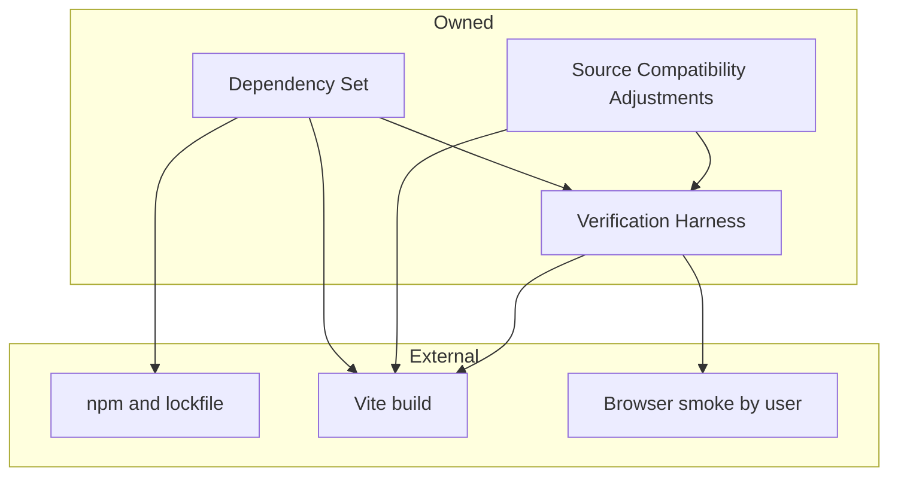
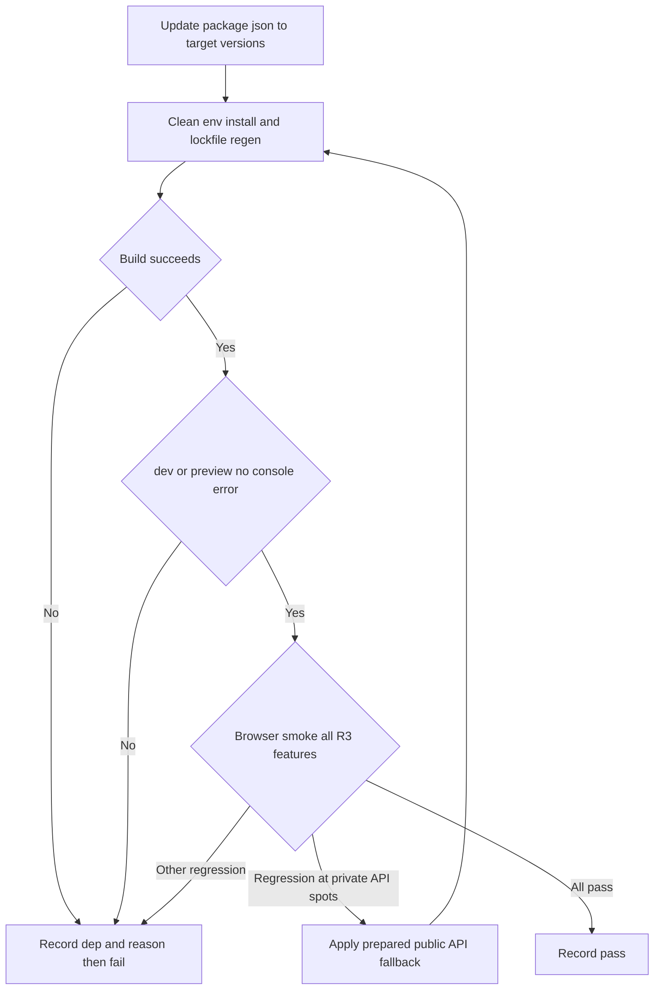
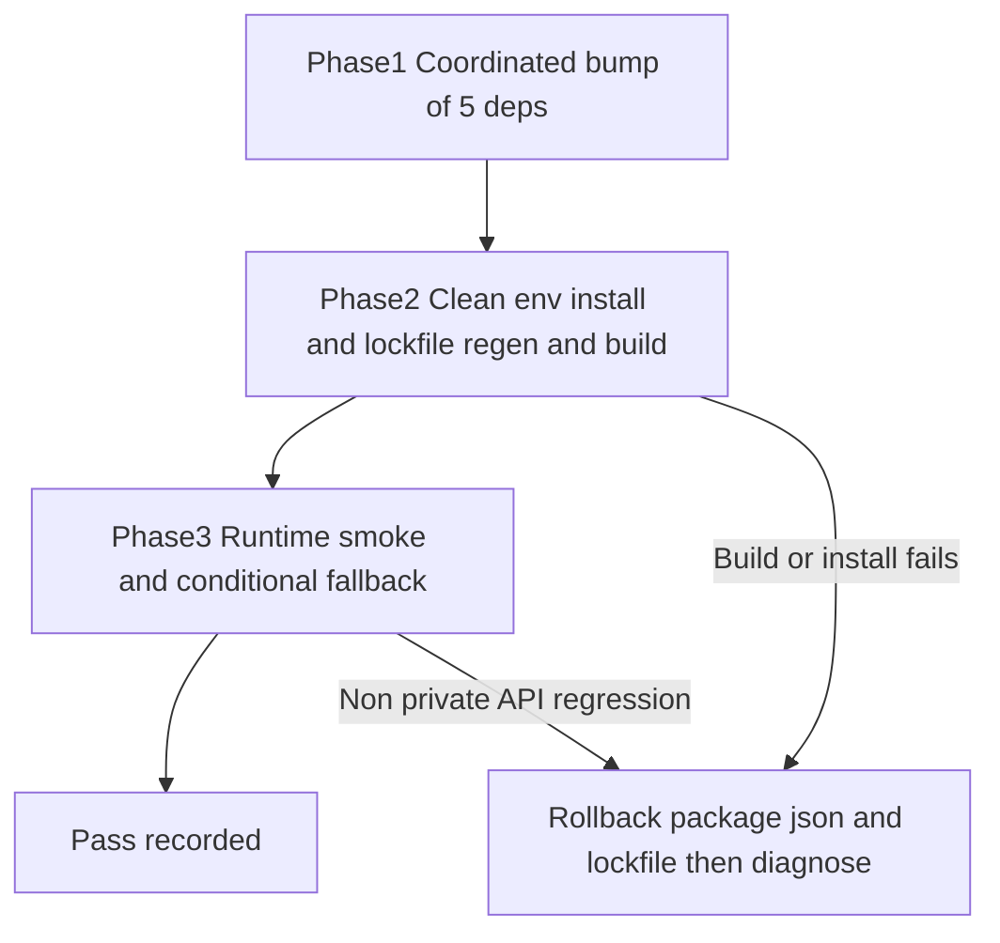

# Design Document

## Overview

**Purpose**: 防災ハザードマップ PWA の全依存（vite / maplibre-gl / @turf/distance / maplibre-gl-opacity / maplibre-gl-gsi-terrain）を、利用者可視挙動を維持したまま discovery 確定の目標版へ協調更新する。
**Users**: 保守開発者・評価者がクリーン環境再現と実機スモークで更新の安全性を確認し、一般利用者は更新後も同一の防災機能を利用する。
**Impact**: 古い依存（技術的負債・セキュリティ修正の取り残し）を解消し、`maplibre-gl-gsi-terrain` の addProtocol 世代不整合を解錠する。アプリのアーキテクチャ・データモデルは変更しない。

### Goals
- 5 依存を目標版（vite 8.0.13 / maplibre-gl 5.24.0 / @turf/distance 7.3.5 / maplibre-gl-opacity 1.8.0 / maplibre-gl-gsi-terrain 2.3.2）へ更新し、lockfile でクリーン環境再現可能にする。
- Requirement 3 の全ユーザー機能を更新前後でリグレッションなく維持する。
- 合格判定をクリーン環境ビルド＋実機スモークの二段に固定し、偽green を排除する。

### Non-Goals
- 機能追加・UI 改修・リファクタリング・Nuxt 構成移行。
- 既存 Popup 生 HTML（XSS）の是正、テスト自動化基盤の新規導入。
- ルート `/specs/`（別フレームワーク成果物）への変更。

## Boundary Commitments

### This Spec Owns
- `package.json` の指定 5 依存の version 更新と `package-lock.json` のクリーン環境再生成（1.1, 1.2, 1.4）。
- 更新起因の最小限の互換調整（私的 API 2 箇所の条件付き公開 API 置換）（3.4, 3.6）。
- クリーン環境再現手順と実機スモーク用チェックリストの提供、合格/不合格の記録（2.x, 3.x, 4.x）。

### Out of Boundary
- アプリの機能・UI・アーキテクチャ・データモデルの変更。
- アップグレード非起因の既存セキュリティ課題（Popup 生 HTML）の是正。
- 指定 5 依存以外の依存追加・置換、Nuxt 移行、ルート `/specs/` 改修。

### Allowed Dependencies
- npm / lockfile 機構、Vite ビルド、対象 5 npm パッケージの目標版、ブラウザ（WebGL2）実行環境、Node `^20.19.0 || >=22.12.0`。
- 既存 `main.js` の公開 API 利用（MapLibre 公開 API、`useGsiTerrainSource(addProtocol)` 署名）。
- 制約: 目標版は固定。maplibre v5 到達は gsi-terrain 2.3.2 と不可分。

### Revalidation Triggers
- 目標版のいずれかが解決不能・非互換と判明（→ 要件/設計再検討）。
- `useGsiTerrainSource(addProtocol)` 署名や MapLibre 公開 API 契約の変更（→ 互換調整範囲の再評価）。
- 私的 API 2 箇所以外にソース改修が必要と判明（→ スコープ再確認）。**【発火・再整合済み 2026-05-19】** Task 3.1 のクリーンビルドで `maplibre-gl-opacity@1.8.0` が `exports` フィールド導入＋CSS を `dist/`→`build/` 移設した破壊的変更が判明し、`main.js` の CSS import パスに3つ目の最小ソース調整が必要となった。requirements.md「Boundary Context → In scope（更新に伴う最小限のソース調整）」が本調整を許容しているため、設計を下記のとおり再整合（modernization 起因の import-path 調整を Source Compatibility Adjustments の対象に含める）。製品判断ではなく仕様整合のため STOP_FOR_HUMAN 非該当。
- Node 実行要件の変更（→ Allowed Dependencies 再検証）。

## Architecture

### Existing Architecture Analysis
- 単一ファイル・フラット構成（`main.js` に全ロジック、Style Spec v8 をインライン宣言）。本スペックはこの構成を維持し、設定（依存版）と検証のみを変更する。
- 維持すべき統合点: MapLibre 公開 API 経路、`useGsiTerrainSource(addProtocol)` による raster-dem 生成、PWA 静的資産（`public/`）。
- 解消する技術的負債: 旧 addProtocol 世代の gsi-terrain 0.0.2。回避対象: 私的フィールド依存（`_watchState` / `_geometry`）。

### Architecture Pattern & Boundary Map



**Architecture Integration**:
- Selected pattern: 設定変更＋検証ハーネス（新ソフトウェア構造を導入しない最小設計）。
- Domain/feature boundaries: 依存版（DepSet）／互換調整（Adjust）／検証（Harness）の 3 責務に分離、共有所有なし。
- Existing patterns preserved: 単一ファイル構成、設定 as データ、相対パスビルド。
- New components rationale: Harness はスモーク手順を成果物化し R4 を満たすために必須。
- Steering compliance: tech.md（二段検証・プラグイン peer 制約・Windows 配慮）、security.md（生 HTML 経路を新規導入しない）。

### Technology Stack

| Layer | Choice / Version | Role in Feature | Notes |
|-------|------------------|-----------------|-------|
| Frontend / CLI | maplibre-gl 5.24.0 / @turf/distance 7.3.5 / maplibre-gl-opacity 1.8.0 / maplibre-gl-gsi-terrain 2.3.2 | アプリ実行時の地図・距離・地形・不透明度 | gsi-terrain 2.3.2 が maplibre v5 を解錠（不可分） |
| Infrastructure / Runtime | Vite 8.0.13 / Node ^20.19.0 \|\| >=22.12.0 | ビルド・dev・preview | 検証環境 Node v24.14.1 で充足 |
| Data / Storage | 該当なし | — | 外部公開タイル依存のみ、データモデル変更なし |
| Messaging / Events | 該当なし | — | — |

## File Structure Plan

### Directory Structure
新規ディレクトリ構造の追加はなし。新規ファイルは検証成果物 1 点のみ。

```
docs/
└── dependency-modernization-smoke-checklist.md   # 実機スモーク手順（R3 各機能の目視判定項目）
```

### Modified Files
- `package.json` — 指定 5 依存の version を目標版へ更新（devDependencies: vite / dependencies: maplibre-gl, @turf/distance, maplibre-gl-opacity, maplibre-gl-gsi-terrain）。それ以外の依存は変更しない。
- `package-lock.json` — クリーン環境で再生成し、目標版が同一再現するロックを得る。
- `main.js` — (a) **条件付き**。実機スモークで破綻が確認された場合にのみ私的 API 2 箇所を公開 API へ置換: `geolocationControl._watchState`（:545）→ 公開状態判定、`nearestFeature._geometry.coordinates`（:568）→ `.geometry.coordinates`。破綻しなければ無改修。(b) **modernization 起因の import-path 調整（ビルド前提）**: 目標版の package layout/`exports` 変更で解決不能になった import を、機能・UI を変えない最小の範囲で修正（例: `maplibre-gl-opacity@1.8.0` の CSS が `dist/`→`build/` 移設＋`exports` 制限により `main.js:7` の CSS import を解決可能パスへ）。

> 各ファイルは単一責務。`main.js` の改修は (a) 私的 API 2 箇所 と (b) modernization 起因の最小 import-path 調整 に限定し、機能・UI 変更を持ち込まない（Out of Boundary）。(b) は requirements.md In-scope「更新に伴う最小限のソース調整」に基づく（Revalidation Triggers 参照、再整合済み）。

## System Flows



- ゲート決定: ビルド成功単独では合格としない（2.3）。実機スモークは利用者目視、実装側はチェックリスト提供（4.2）。
- 私的 API 起因の回帰のみフォールバック適用後に再検証ループへ戻す。それ以外の回帰は不合格として原因記録（4.3）。

## Requirements Traceability

| Requirement | Summary | Components | Interfaces / Contracts | Flows |
|-------------|---------|------------|------------------------|-------|
| 1.1 | 5 依存を目標版へ解決 | Dependency Set | Dependency Manifest Contract | Update→Clean |
| 1.2 | lockfile でクリーン再現 | Dependency Set | Dependency Manifest Contract | Clean |
| 1.3 | 解決不能を記録し不合格 | Dependency Set, Verification Harness | Pass/Fail Record | Build Fail |
| 1.4 | 指定 5 依存に限定 | Dependency Set | Dependency Manifest Contract | Update |
| 2.1 | クリーン環境ビルド成功 | Verification Harness | Clean-env Repro Contract | Build |
| 2.2 | dev/preview がコンソールエラーなし | Verification Harness | Clean-env Repro Contract | Serve |
| 2.3 | ビルド単独で合格としない | Verification Harness | Gate Decision | Gate |
| 3.1 | 背景＋重畳ハザード表示 | Verification Harness | Smoke Checklist | Smoke |
| 3.2 | 不透明度切替反映 | Verification Harness | Smoke Checklist | Smoke |
| 3.3 | 現在地取得反映 | Verification Harness | Smoke Checklist | Smoke |
| 3.4 | 現在地オフで非表示 | Source Compatibility Adjustments, Verification Harness | Watch-state Behavior Contract | Smoke→Adjust |
| 3.5 | 避難所クリックでポップアップ | Verification Harness | Smoke Checklist | Smoke |
| 3.6 | 条件成立時に経路ライン描画 | Source Compatibility Adjustments, Verification Harness | Nearest-geometry Behavior Contract | Smoke→Adjust |
| 3.7 | 条件未成立で経路ライン非表示 | Source Compatibility Adjustments, Verification Harness | Nearest-geometry Behavior Contract | Smoke→Adjust |
| 3.8 | 3D 地形・陰影表示 | Dependency Set, Verification Harness | Smoke Checklist | Smoke |
| 4.1 | build＋実機スモーク双方で合格 | Verification Harness | Gate Decision | Gate |
| 4.2 | チェックリスト提供・目視は利用者 | Verification Harness | Smoke Checklist | Smoke |
| 4.3 | 再現不可は原因記録し不合格 | Verification Harness | Pass/Fail Record | Fail |
| 4.4 | 更新前後でリグレッションなし | Verification Harness | Smoke Checklist | Smoke |

## Components and Interfaces

| Component | Domain/Layer | Intent | Req Coverage | Key Dependencies (P0/P1) | Contracts |
|-----------|--------------|--------|--------------|--------------------------|-----------|
| Dependency Set | Build config | 目標版へ依存更新と lockfile 再現 | 1.1,1.2,1.3,1.4,3.8 | npm/lockfile (P0), Vite (P0) | State |
| Source Compatibility Adjustments | App source | 私的 API の条件付き公開 API 置換 | 3.4,3.6 | MapLibre 公開 API (P0) | Service |
| Verification Harness | Verification | クリーン再現＋実機スモーク＋合格判定 | 2.1,2.2,2.3,3.1-3.8,4.1,4.2,4.3,4.4 | Vite (P0), Browser (P0, 利用者目視) | Batch, State |

> 本プロジェクトは型システムなし（プレーン JS）。契約は TypeScript ではなく振る舞いの事前/事後条件で規定する（必要に応じ JSDoc）。

### Build config

#### Dependency Set
| Field | Detail |
|-------|--------|
| Intent | 指定 5 依存を目標版へ更新し、クリーン環境で再現可能な lockfile を確立 |
| Requirements | 1.1, 1.2, 1.3, 1.4, 3.8 |

**Responsibilities & Constraints**
- `package.json` の指定 5 依存のみを目標版へ更新（他依存・他版へ波及しない）。
- `package-lock.json` をクリーン環境で再生成し、同一版が再現すること。
- データ所有なし。version 指定の単一権威。

**Dependencies**
- External: npm / lockfile — 依存解決と固定（P0）
- External: Vite 8.0.13 — ビルド整合（P0）

**Contracts**: State [x]

##### Dependency Manifest Contract
- Precondition: 対象は `vite`, `maplibre-gl`, `@turf/distance`, `maplibre-gl-opacity`, `maplibre-gl-gsi-terrain` の 5 件のみ。
- Postcondition: 解決版が vite 8.0.13 / maplibre-gl 5.24.0 / @turf/distance 7.3.5 / maplibre-gl-opacity 1.8.0 / maplibre-gl-gsi-terrain 2.3.2。lockfile がクリーン環境で同一再現。
- Invariant: 指定外依存の追加・削除・版変更を行わない。
- Failure: いずれか解決不能なら依存名と理由を Pass/Fail Record へ記録し不合格（1.3）。

**Implementation Notes**
- Integration: gsi-terrain 2.3.2 は `useGsiTerrainSource(addProtocol)` 署名不変のため `main.js` 改修不要が前提。
- Validation: クリーン環境（lockfile 再現）で検証。`@turf/distance` の default export 互換はビルド成否で判定（事前断定しない）。
- Risks: Windows で npm install がファイルロック断続失敗 → 実状態診断後 `npm install` 優先・再試行。

### App source

#### Source Compatibility Adjustments
| Field | Detail |
|-------|--------|
| Intent | 私的 API 依存 2 箇所を、実機破綻時にのみ公開 API へ置換 |
| Requirements | 3.4, 3.6 |

**Responsibilities & Constraints**
- 変更対象: (a) `main.js:545`（`geolocationControl._watchState`）と `main.js:568`（`nearestFeature._geometry.coordinates`）の条件付き置換、(b) modernization 起因の最小 import-path 調整（目標版の `exports`/レイアウト変更で解決不能になった import の解決可能化。例: `maplibre-gl-opacity@1.8.0` の CSS import）、(c) **modernization 起因の視覚パリティ回復**（更新で新たに生じた利用者可視の体裁差を、機能・UI 機能を変えず最小の CSS override 等で更新前へ戻す。例: `maplibre-gl-opacity@1.8.0` 同梱 CSS が `#opacity-control` に新規描画する下線の抑止＝要件 3.2/4.4 パリティ）。これら以外のソース改修はしない。**【Revalidation Trigger 2度目発火・再整合済み 2026-05-19】** Task 4.1 で (c) の視覚リグレッションを検出。requirements In-scope「更新に伴う最小限のソース調整」＋要件 4.4 に基づき本スコープに含める（製品判断ではなくパリティ回復のため STOP_FOR_HUMAN 非該当）。
- 機能・挙動を変えず、観測挙動を維持することが目的。**3.4 / 3.6 / 3.7 は同一の毎フレーム描画コールバック領域（`main.js` の現在地・経路描画ロジック）に同居する連動集合**であり、私的 API のいずれかを置換した場合は 3.4 / 3.6 / 3.7 を一括で再検証する。

**Dependencies**
- External: MapLibre GL JS 5.24.0 公開 API — 公開状態判定・公開ジオメトリ参照（P0）

**Contracts**: Service [x]

##### Watch-state Behavior Contract（3.4）
- Precondition: GeolocateControl が存在し現在地取得状態が判定可能。
- Postcondition: 現在地取得がオフのとき、現在地および現在地起点の経路ラインを表示しない。
- 置換指針: 私的 `_watchState` 直接参照を、公開的に取得可能な状態判定へ置換（破綻時のみ）。

##### Nearest-geometry Behavior Contract（3.6, 3.7）
- Precondition: 最寄り避難施設の地物が取得済み。
- Postcondition（3.6）: 規定ズーム閾値以上かつ現在地確定時、現在地と最寄り施設を結ぶ経路ラインを描画。
- Postcondition（3.7）: 規定ズーム閾値未満または現在地未確定時、経路ラインを非表示（3.6 の負条件側。同一描画領域のため 3.6 の置換が 3.7 にも波及し得る）。
- 置換指針: 私的 `_geometry` を公開 `.geometry.coordinates` へ置換（破綻時のみ）。置換時は 3.6 と 3.7 を対で再検証。

**Implementation Notes**
- Integration: 置換 (a) は実機スモークで該当挙動の破綻が確認された場合のみ適用。(b) は目標版で import 解決不能となった場合に適用。(c) は実機スモークで更新起因の視覚リグレッションが確認された場合に適用（要件 3.2/4.4）。いずれも適用時は Clean-env Repro（クリーン環境ビルド/起動）と全スモーク（3.1-3.8、特に連動集合 3.4/3.6/3.7、および (c) では当該視覚項目の利用者再目視）を再実行する再検証ループへ戻す。
- Validation: 最終合格判定は置換後に再実行したエビデンスで行う（置換前エビデンスでの合格記録を禁止）。
- Risks: 静的解析では断定不可。未破綻なら無改修（不要改修の回避）。

### Verification

#### Verification Harness
| Field | Detail |
|-------|--------|
| Intent | クリーン環境再現・実機スモーク・合格判定を成果物化 |
| Requirements | 2.1, 2.2, 2.3, 3.1-3.8, 4.1, 4.2, 4.3, 4.4 |

**Responsibilities & Constraints**
- クリーン環境（lockfile 再現）で build / dev / preview を実行し結果を判定。
- `docs/dependency-modernization-smoke-checklist.md` を R3 各機能に 1:1 対応で提供。
- 合格 = クリーン環境ビルド/起動成立 ∧ 実機スモーク全項目通過。ビルド単独不可。

**Dependencies**
- External: Vite 8.0.13 — build/dev/preview（P0）
- External: Browser（WebGL2）— 実機スモーク（P0、目視は利用者）

**Contracts**: Batch [x] / State [x]

##### Clean-env Repro Contract（2.1, 2.2）
- Trigger: クリーン環境（lockfile 再現）でのビルド/起動。
- Input/validation: 再生成済み lockfile。
- Output: ビルド成果物生成・初期地図表示・コンソールエラー無し。
- Idempotency/recovery: 失敗時は依存名/原因を記録し不合格（rollback は Migration Strategy 参照）。

##### Smoke Checklist（3.1-3.8, 4.2, 4.4）
- 項目は R3.1〜R3.8 に 1:1 対応（背景＋ハザード／不透明度切替／現在地反映／オフで非表示／クリックポップアップ／経路ライン描画／閾値未満で非表示／3D 地形・陰影）。
- 目視判定は利用者が実施、実装側はチェックリストと再現手順を提供。

##### Gate Decision / Pass/Fail Record（1.3, 2.3, 4.1, 4.3）
- 合格条件: Clean-env Repro 成立 ∧ Smoke 全項目 pass。
- 不合格時: 該当機能/依存と原因を記録。私的 API 起因のみ Adjust 後に再検証。

**Implementation Notes**
- Integration: System Flows のゲート分岐に従う。
- Validation: 偽green 回避のためビルド単独合格を禁止（tech.md 整合）。
- Risks: 実機目視は自動化不可。チェックリストの再現性で品質担保。

## Data Models

該当なし — 本スペックは依存版と検証のみを変更し、ドメイン/論理/物理データモデルの変更を伴わない。

## Error Handling

### Error Strategy
早期失敗・偽green 排除。検証失敗は原因を記録して不合格とし、私的 API 起因の回帰のみ準備済みフォールバックで回復を試みる。

### Error Categories and Responses
- **依存解決失敗**（1.3）: 目標版に解決不能 → 依存名・理由を Pass/Fail Record に記録し不合格。
- **ビルド/起動失敗**（2.1, 2.2）: クリーン環境でビルド不成立・dev/preview コンソールエラー → 不合格、原因記録。`@turf/distance` default export 不整合もここで顕在化。
- **実機リグレッション**（4.3, 4.4）: R3 機能が再現しない → 不合格。私的 API 2 箇所起因なら公開 API フォールバック適用後に再検証、他要因は不合格として記録。
- **環境（Windows ファイルロック）**: npm install / git ref 操作の断続失敗 → 先に実状態診断、`npm install` 優先、再試行（実装順序/リスクに影響するため明示）。

### Monitoring
自動監視基盤なし。検証結果（pass/fail と原因）を記録として残す。サーバログ・座標等の利用者データを残さない（security.md 整合）。

## Testing Strategy

### Clean-env Build/Serve（R2）
- クリーン環境（lockfile 再現）で本番ビルドが成果物を生成すること（2.1）。
- dev / preview がブラウザコンソールにエラーを出さず初期地図表示すること（2.2）。
- ビルド成功のみで合格としないこと（2.3, 4.1）。

### Browser Smoke（R3 受け入れ基準由来・利用者目視）
- 背景地図＋6 種ハザード重畳の表示（3.1）。
- 不透明度コントロールの切替・不透明度反映（3.2）。
- 現在地取得の有効化で現在地反映（3.3）／オフで現在地・経路ライン非表示（3.4）。
- 指定緊急避難場所クリックで名称・住所・備考・対応災害種別のポップアップ（3.5）。
- ズーム閾値以上＋現在地確定で経路ライン描画（3.6）／閾値未満または未確定で非表示（3.7）。
- 3D 地形表示有効化で地形誇張・陰影（3.8）。

### Regression Confirmation（R4）
- 更新前後で上記各項目に利用者可視リグレッションが無いこと（4.4）、再現不可は原因記録し不合格（4.3）。

## Security Considerations
- 本スペックは認証・秘匿情報・データモデルを扱わない。security.md のベースライン方針に従う。
- 非退行: `main.js` 改修時に新たな未信頼データの生 HTML 描画経路を導入しない。既存 Popup 生 HTML（XSS）は Out of Boundary（是正も悪化もさせない）。
- ライセンス: 目標版は BSD-3 / MIT 系で問題なし（research.md 参照）。位置情報はクライアント内のみ・外部送信しない。

## Migration Strategy



- Phase 1: 5 依存を同時更新（gsi-terrain↔maplibre 結合のため分割不可）。
- Phase 2: クリーン環境で install→lockfile 再生成→ビルド。失敗時は `package.json`/`package-lock.json` を revert し原因診断。
- Phase 3: 実機スモーク。私的 API 起因の回帰のみフォールバック適用→Phase 2 へ再ループ。他回帰は rollback。
- Rollback triggers: クリーン環境ビルド/install 失敗、私的 API 以外のリグレッション。
- Validation checkpoints: Phase 2 末（ビルド/起動）、Phase 3 末（スモーク全項目）。
