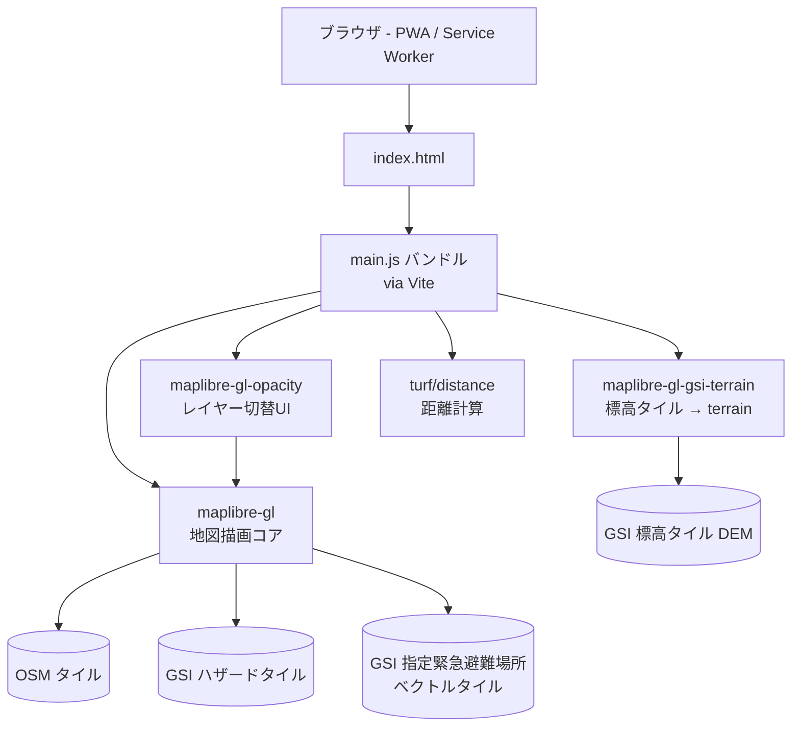

# ライブラリバージョンアップ アーキテクチャ設計

**作成日**: 2026-05-20
**関連要件定義**: [requirements.md](../../spec/library-version-upgrade/requirements.md)
**関連ノート**: [note.md](../../spec/library-version-upgrade/note.md)
**ヒアリング記録**: [design-interview.md](design-interview.md)

## 信頼性レベル凡例
- 🔵 **青信号**: 要件定義・既存コード・メモから直接取得した確実な設計
- 🟡 **黄信号**: 要件定義・既存コード・メモから妥当に推測した設計
- 🔴 **赤信号**: 根拠のない推測

---

## システム概要 🔵

**信頼性**: 🔵 *要件定義 概要節 / [docs/tech-stack.md](../../tech-stack.md) より*

本要件は **依存パッケージ 5 件の世代更新タスク**であり、新規アーキテクチャの導入は伴わない。既存の「Vanilla JS + Vite + MapLibre GL JS」構成を維持しつつ、各依存を相互整合する最新版に揃える。アプリケーション境界・ファイル構成・ビルドフロー・ランタイムデータフローは原則そのまま、`main.js` 1 ファイル + `index.html` の構成を維持する。

唯一の能動的なコード変更点は **REQ-501（`_watchState` 非公開 API への直接参照を、`GeolocateControl` の公開イベントに置き換え）** のみ。

## アーキテクチャパターン 🔵

**信頼性**: 🔵 *既存 `main.js` / `index.html` / `package.json` より*

- **パターン**: シングルファイル Vanilla JS SPA（静的ホスティング）+ PWA
- **選択理由**: 既存構成を維持。本要件のスコープは「依存更新 + 最小差分書き換え」（REQ-403）。Nuxt 化や TypeScript 化は別シナリオに切り分け済み。
- **変更しないもの**:
  - `index.html` のエントリ構造（`<div id="map">` + `<script type="module">` + Service Worker 登録）
  - `main.js` のロジック構造（地図初期化 → load イベント → クリック/mousemove/render ハンドラ）
  - `vite build --base=./` の相対パス出力
  - PWA（`manifest.json` + `sw.js`）

## コンポーネント構成

### ビルド・開発サーバー（Vite） 🔵

**信頼性**: 🔵 *要件 REQ-001 / REQ-103 / ヒアリング Q3, Q6 より*

- **目標バージョン**: Vite v6 系最新（Node.js 18+ / 20+ / 22+ 要件）
- **フォールバック**: Node 環境または他依存と整合しない場合、Vite v5 系最新へ後退（Q3 = b 一段戻し許容）
- **設定変更**: 原則なし。`scripts.build` の `--base=./` は維持（REQ-402）
- **Node.js バージョン追記**: 採用 Vite の最低 Node 要件を `docs/tech-stack.md` の「セットアップ手順」節に追記（REQ-103 / Q6 = i）

### 地図ライブラリ（MapLibre GL JS） 🔵

**信頼性**: 🔵 *要件 REQ-001 / REQ-005 / REQ-102 / [[reference_maplibre_v5_attribution_sanitizer]] より*

- **目標バージョン**: MapLibre GL JS v5 系最新
- **フォールバック順序**（Q3 = b / Q4 = a 一段戻し許容に基づく）:
  1. v5 系最新（候補）
  2. v5 系 latest-1（minor 一段戻し）
  3. v4 系最新（メジャー一段戻し、`maplibre-gl-gsi-terrain` 互換のため）
  4. v3 系最新（プラグイン依存上やむを得ない場合）
- **使用 API**: `Map` / `Popup` / `GeolocateControl` / `TerrainControl` / `addProtocol` / `addSource` / `addLayer` / `addControl` / `getStyle` / `querySourceFeatures` / `queryRenderedFeatures` / `getSource` / `getCanvas` / `getZoom`
- **attribution 安全性**: メモ [[reference_maplibre_v5_attribution_sanitizer]] に基づき、`attribution` 文字列は既存の固定タイルプロバイダのみとし、利用者入力経路を新規に持ち込まない（REQ-404 / NFR-102）

### Opacity プラグイン（maplibre-gl-opacity） 🟡

**信頼性**: 🟡 *要件 REQ-101 / 既存 main.js 行430-455 / プラグイン側のリリース情報未確認*

- **目標バージョン**: 採用 `maplibre-gl` メジャーに対応する `maplibre-gl-opacity` 最新版
- **互換性方針**: プラグインが採用 `maplibre-gl` 版に未対応の場合、`maplibre-gl` をその一段下に揃える（REQ-101 と整合）
- **使用 API**: `OpacityControl({ baseLayers })` コンストラクタ + `map.addControl(opacity, position)`

### 標高タイルプラグイン（maplibre-gl-gsi-terrain） 🔵

**信頼性**: 🔵 *要件 REQ-102 / EDGE-001 / ヒアリング Q4 = (a) より*

- **目標バージョン**: 採用 `maplibre-gl` 版に対応する `maplibre-gl-gsi-terrain` 最新版
- **互換性方針（Q4 確定）**: プラグインが採用 `maplibre-gl` 版に対応していない場合、**`maplibre-gl` を一段戻して整合させる**（terrain 機能の維持を優先、代替プラグイン採用や無効化は採らない）
- **使用 API**: `useGsiTerrainSource(maplibregl.addProtocol)`（`main.js` 行580）
- **設計上の注意**: `addProtocol` のシグネチャは MapLibre v4 以降で変更されている可能性がある（旧: コールバック方式、新: Promise 方式）。本プラグインが内部で `addProtocol` を呼ぶ実装に依存しているため、プラグイン版と `maplibre-gl` 版のペアを必ず一致させる

### 地理演算（@turf/distance） 🔵

**信頼性**: 🔵 *要件 REQ-405 / 既存 main.js 行10 / メモ [[project_001_false_green_build]] より*

- **目標バージョン**: `@turf/distance` v7 系最新
- **import 形式**: 既存の `import distance from '@turf/distance'`（default import）を**維持**（REQ-405）
- **設計上の注意**: v7 は ESM-only である点が Vite v6 の ESM 中心方針と整合的。CJS 依存の混在 build エラーが出た場合のみ最小差分で対応

## バージョン選定戦略（決定マトリクス） 🔵

**信頼性**: 🔵 *ヒアリング Q3, Q4 / 要件 REQ-101 / REQ-102 より*

```
[ステップ 1] 候補組み合わせの構築
  vite@latest
  maplibre-gl@latest
  maplibre-gl-opacity@latest
  maplibre-gl-gsi-terrain@latest
  @turf/distance@latest

[ステップ 2] npm install + 依存解決を試行
  ├─ ERESOLVE / peer dep 警告なし → ステップ 3
  └─ 衝突あり → 衝突中心パッケージ（プラグイン優先）を一段戻して再試行

[ステップ 3] npm run build を試行
  ├─ 成功 → ステップ 4
  └─ 失敗 → 失敗版を一段戻して再試行

[ステップ 4] npm run dev で初期描画を実機確認
  ├─ 初期ロードでコンソール例外なし、地図描画 OK → ステップ 5
  └─ addProtocol / 描画系の runtime エラー → maplibre-gl を一段戻して再試行
       （EDGE-001 / Q4 = a）

[ステップ 5] REQ-501 の _watchState 撤去を実装

[ステップ 6] クリーン環境再現（rm node_modules package-lock.json → install → build）
  ├─ 成功 → 完成
  └─ 失敗 → 偽 green と判定し、ステップ 2 から再選定
       （NFR-302 / メモ [[project_001_false_green_build]]）
```

## REQ-501: `_watchState` 撤去の設計 🔵

**信頼性**: 🔵 *要件 REQ-501 / 既存 main.js 行418-425, 543-554 / ヒアリング Q5 = (i) より*

### 現状（変更前）

```js
// main.js:418
const geolocationControl = new maplibregl.GeolocateControl({
    trackUserLocation: true,
});
// ...
geolocationControl.on('geolocate', (e) => {
    userLocation = [e.coords.longitude, e.coords.latitude];
});

// main.js:543（render リスナー内）
map.on('render', () => {
    if (geolocationControl._watchState === 'OFF') userLocation = null; // ← 非公開 API
    if (map.getZoom() < 7 || userLocation === null) {
        // route source を空に
        return;
    }
    // ... 最寄り地物計算 + route 更新
});
```

### 変更後（公開イベント駆動）

```js
const geolocationControl = new maplibregl.GeolocateControl({
    trackUserLocation: true,
});

geolocationControl.on('geolocate', (e) => {
    userLocation = [e.coords.longitude, e.coords.latitude];
});

// 追加: 公開イベントによる追跡停止検知（REQ-501）
geolocationControl.on('trackuserlocationend', () => {
    userLocation = null;
});

map.on('render', () => {
    // _watchState 参照を削除（REQ-501）
    if (map.getZoom() < 7 || userLocation === null) {
        // route source を空に
        return;
    }
    // ... 最寄り地物計算 + route 更新
});
```

### 設計上の留意点

- `trackuserlocationend` は MapLibre GL JS で `trackUserLocation: true` が有効なときに、ユーザーが GeolocateControl を OFF / トラッキング解除した際に発火する公開イベント。
- 採用版で `trackuserlocationend` が無い／名称が違う場合は、`trackuserlocationstart` の補集合や `geolocate` イベントの停止検知で代替するが、これは設計時点では未確定（実装時に採用版のイベント一覧で確認）。
- `_watchState === 'OFF'` 由来の挙動（OFF 時に `userLocation` を `null` に戻す）は維持する。

## システム構成図 🔵

**信頼性**: 🔵 *既存 main.js / index.html / docs/tech-stack.md より*



本要件で変わるのは **バンドル内の各依存のバージョン**と **`main.js` の `_watchState` 参照箇所** のみ。外部タイル CDN 構成は変更しない。

## ディレクトリ構造 🔵

**信頼性**: 🔵 *既存リポジトリ実測より*

```
./
├── index.html              # PWA エントリ
├── main.js                 # 全ロジック（REQ-501 で1箇所書き換え）
├── style.css               # 空（変更なし）
├── package.json            # ← 5 依存を一斉更新
├── package-lock.json       # ← 再生成（NFR-302 で必須コミット）
├── public/                 # 静的アセット（変更なし）
├── docs/
│   ├── tech-stack.md       # ← Node 最低バージョン追記（REQ-103）
│   ├── spec/library-version-upgrade/    # 要件
│   └── design/library-version-upgrade/  # 本ファイル
└── dist/                   # vite build 出力（再生成される）
```

## 非機能要件の実現方法

### パフォーマンス 🟡

**信頼性**: 🟡 *NFR-001 / NFR-002 と Vite/MapLibre のリリース慣行から妥当な推測*

- **dev コールドスタート**: Vite v6 化により esbuild ベースの prebundle 効果で同等以上が期待される。NFR-001 の閾値「現行比 2 倍を超えない」を `npm run dev` 起動時計測で確認
- **build 成果物サイズ**: 各依存の更新で多少の増減はあり得るが、依存追加はしないため大きな増加は想定しない。NFR-002 の閾値「現行比 2 倍を超えない」を `dist/` 合計サイズで確認
- **最適化戦略**: 追加導入はしない（コード分割・遅延読み込み等はスコープ外）

### セキュリティ 🔵

**信頼性**: 🔵 *NFR-101 / NFR-102 / [[reference_maplibre_v5_attribution_sanitizer]] / [[feedback_no_raw_html_user_input]] より*

- **`attribution` 経路**: 利用者入力を新規に流さない。既存の固定タイルプロバイダ文字列のみを維持（REQ-404）
- **`npm audit`**: 依存更新後に high/critical 件数が増えないことを `npm audit --omit=dev` で確認（NFR-101）
- **Popup `setHTML`**: 既存の `main.js` 行479-513 はベクトルタイル属性データを HTML 文字列に埋め込んでいる。本要件では**書き換えない**（スコープ外、REQ-403）が、メモ [[feedback_no_raw_html_user_input]] の方針に照らすと将来的に対処すべき箇所（次要件以降の改善対象として記録）

### 移植性・運用 🔵

**信頼性**: 🔵 *NFR-301 / NFR-302 / [[project_windows_env_filelock]] / [[project_001_false_green_build]] より*

- **Windows ファイルロック**: `npm install` 中の EPERM/EBUSY はリトライ許容（NFR-301）
- **lockfile 必須コミット**: 再生成された `package-lock.json` をコミットに含める。これにより lockfile 再現環境での偽 green を防ぐ（NFR-302）
- **クリーン環境再現**: 受け入れ基準 TC-REQ-002-01 で `rm -rf node_modules package-lock.json` → `npm install` → `npm run build` を必須化

## 技術的制約

### スコープ制約 🔵

**信頼性**: 🔵 *要件 REQ-403 / ヒアリング Q5 より*

- 本要件で許容される変更:
  1. `package.json` の依存バージョン更新
  2. `package-lock.json` 再生成
  3. `main.js` の `_watchState` 直接参照の撤去（REQ-501）
  4. `docs/tech-stack.md` の Node 最低バージョン追記（REQ-103）
- **本要件で行わない変更**:
  - TypeScript 化、Lint/Formatter 導入
  - Nuxt 移行、背景地図切替などの別シナリオ
  - `main.js` の他箇所のリファクタ（Popup `setHTML` の安全化等）

### 互換性制約 🔵

**信頼性**: 🔵 *要件 REQ-401 / REQ-402 / REQ-405 より*

- `package.json` の `"type": "module"` を維持
- `scripts.dev` / `scripts.build` / `scripts.preview` を維持
- `vite build --base=./` を維持（相対パス配信前提）
- `@turf/distance` の default import 形式を維持

## 関連文書

- **データフロー**: [dataflow.md](dataflow.md)
- **設計ヒアリング記録**: [design-interview.md](design-interview.md)
- **要件定義**: [requirements.md](../../spec/library-version-upgrade/requirements.md)
- **受け入れ基準**: [acceptance-criteria.md](../../spec/library-version-upgrade/acceptance-criteria.md)
- **準備タスク**: [prep.md](../../spec/library-version-upgrade/prep.md)
- **技術スタック**: [docs/tech-stack.md](../../tech-stack.md)

## 信頼性レベルサマリー

- 🔵 青信号: 13 件 (87%)
- 🟡 黄信号: 2 件 (13%)
- 🔴 赤信号: 0 件 (0%)

**品質評価**: 高品質（要件・既存コード・メモから根拠が明確。残る 🟡 はパフォーマンス閾値とプラグイン側のリリース対応状況の不確実性）
