# ライブラリバージョンアップ データフロー図

**作成日**: 2026-05-20
**関連アーキテクチャ**: [architecture.md](architecture.md)
**関連要件定義**: [requirements.md](../../spec/library-version-upgrade/requirements.md)

## 信頼性レベル凡例
- 🔵 **青信号**: 要件定義・既存コード・メモから直接取得した確実なフロー
- 🟡 **黄信号**: 要件定義・既存コード・メモから妥当に推測したフロー
- 🔴 **赤信号**: 根拠のない推測

---

## 1. 全体像：本要件で「変わるフロー」と「変わらないフロー」 🔵

**信頼性**: 🔵 *要件定義の REQ 群 / 既存 main.js より*

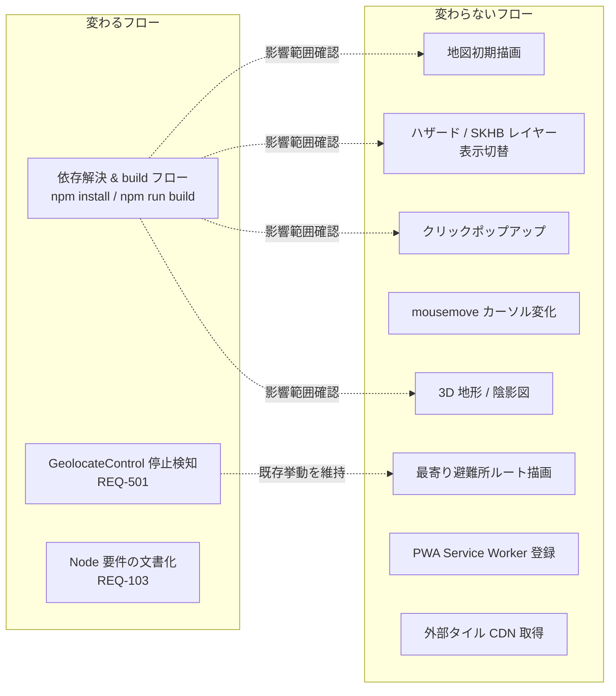

本ドキュメントでは「変わるフロー」3 件を中心に図化し、「変わらないフロー」は受け入れ基準（[acceptance-criteria.md](../../spec/library-version-upgrade/acceptance-criteria.md) TC-REQ-005-01〜B01）で目視確認を行うことを参照のみ示す。

---

## 2. 依存解決と build フロー 🔵

**信頼性**: 🔵 *要件 REQ-001/002/003/101 / NFR-302 / メモ [[project_001_false_green_build]] より*

### 2.1 通常パス（成功時）

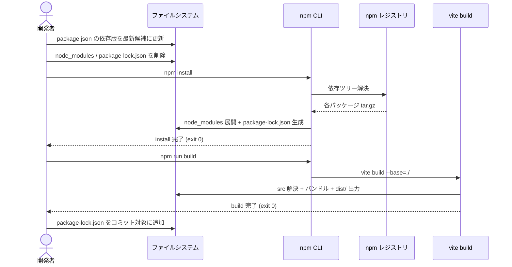

### 2.2 衝突時パス（一段戻し戦略） 🔵

**信頼性**: 🔵 *ヒアリング Q3 = (b) / Q4 = (a) / EDGE-101 より*

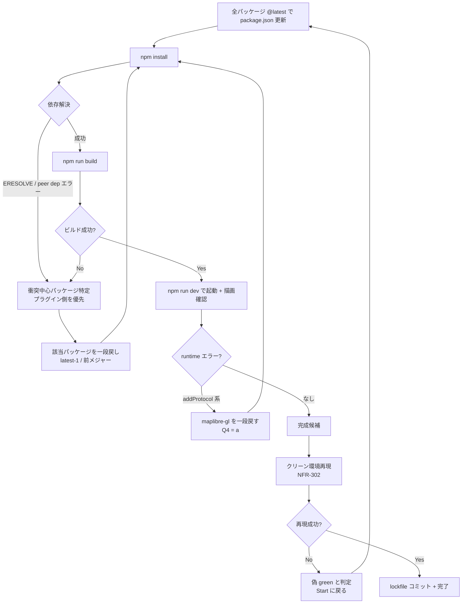

### 2.3 入出力データ

| ステップ | 入力 | 出力 |
|---|---|---|
| package.json 更新 | 旧バージョン文字列 | 新バージョン文字列（候補） |
| `npm install` | package.json + （任意） lockfile | node_modules / package-lock.json |
| `npm run build` | node_modules + main.js + index.html | `dist/index.html` / `dist/assets/*.js` / `dist/assets/*.css` |
| クリーン再現 | コミット済み package.json + package-lock.json | `dist/` 同等成果物 |

---

## 3. ランタイム：GeolocateControl 停止検知フロー（REQ-501） 🔵

**信頼性**: 🔵 *要件 REQ-501 / 既存 main.js 行418-425, 543-554 / ヒアリング Q5 = (i) より*

### 3.1 現状（変更前 = `_watchState` 直接参照）

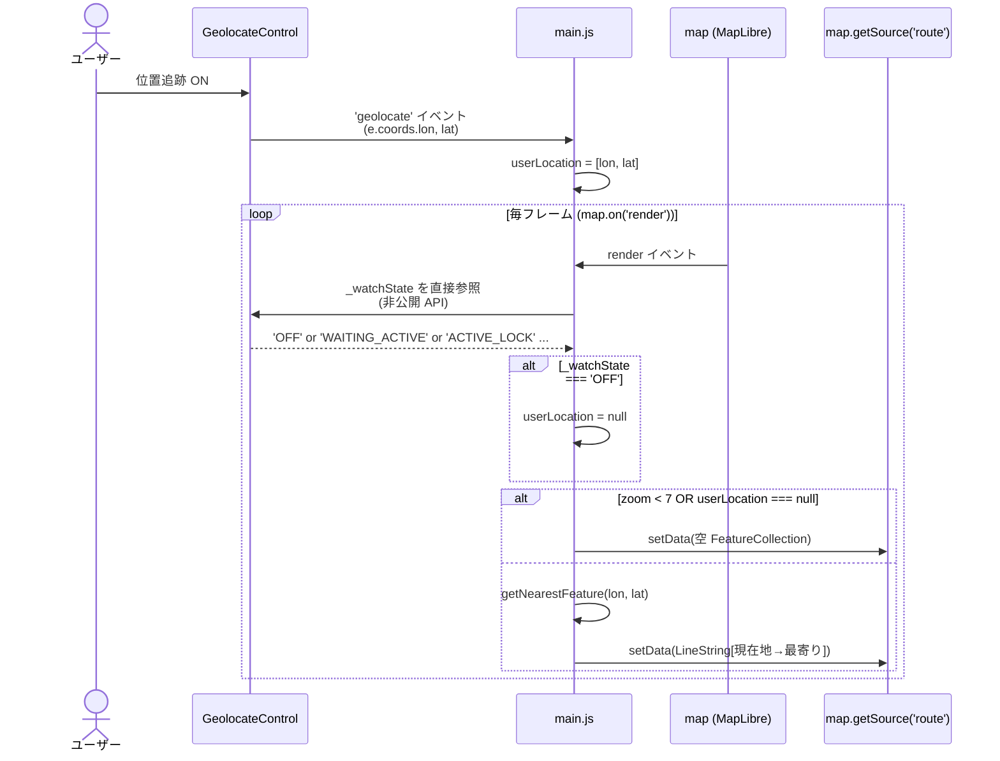

### 3.2 変更後（REQ-501 = 公開イベント駆動） 🔵

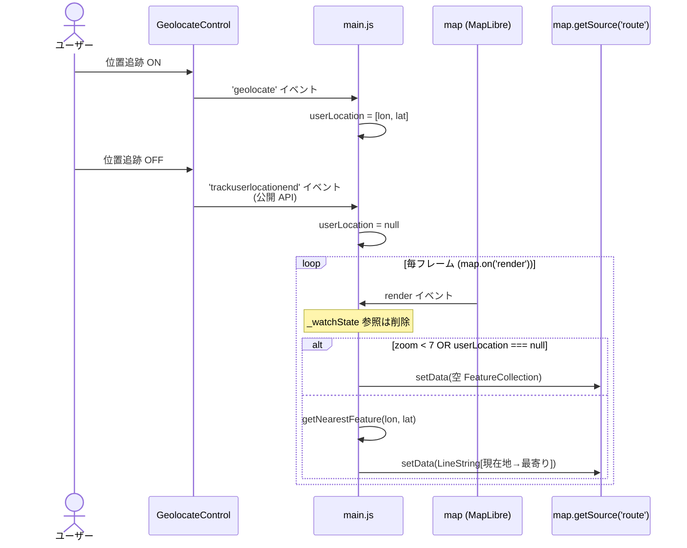

### 3.3 状態遷移 🔵

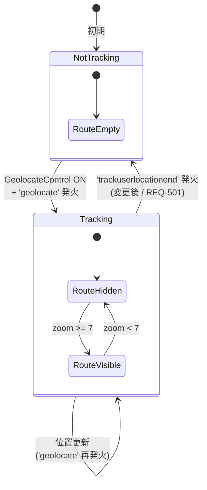

### 3.4 差分の本質 🔵

- **変更前**: `render` ハンドラ内で `geolocationControl._watchState` を **pull 型に毎フレーム照会**。MapLibre 内部実装変更で破綻するリスクあり（EDGE-002）。
- **変更後**: `trackuserlocationend` を **push 型に一度購読**。MapLibre のメジャーアップでイベント名が安定している限り、内部実装の変更に追随不要。
- **コード差分（概念）**:
  - 追加: `geolocationControl.on('trackuserlocationend', () => { userLocation = null; });`
  - 削除: `render` 内の `if (geolocationControl._watchState === 'OFF') userLocation = null;`

---

## 4. 既存ランタイムフロー（参考・変更なし） 🔵

**信頼性**: 🔵 *既存 main.js より、本要件で挙動を変えない*

以下は「変えない」ことを明示するための参考図。受け入れ基準 TC-REQ-005-01〜B01 で同等性を確認する。

### 4.1 タイル取得経路

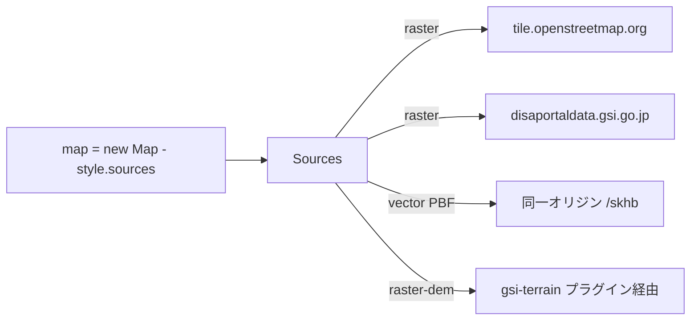

### 4.2 クリックポップアップ

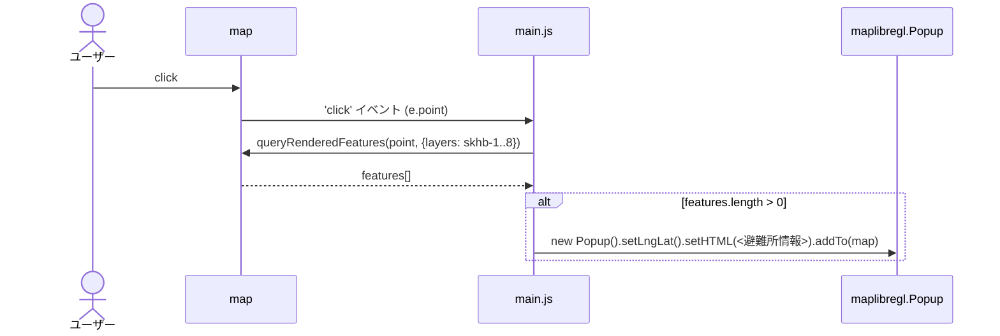

### 4.3 最寄り避難所計算（Turf v7 採用後も挙動不変） 🔵

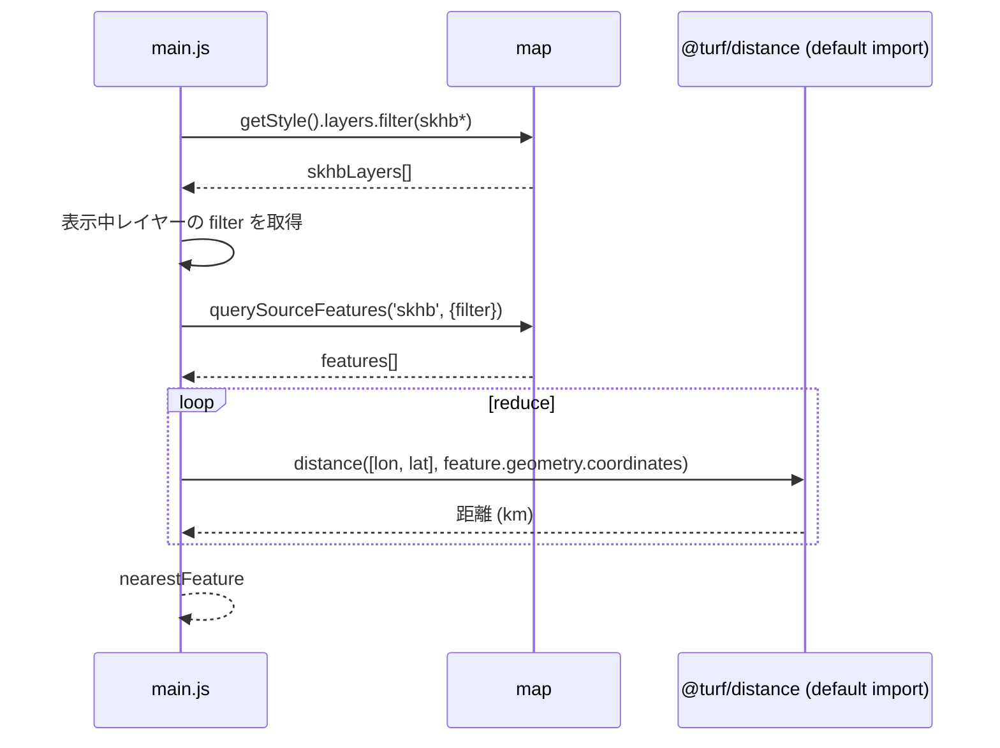

---

## 5. エラーハンドリングフロー（依存解決 / runtime） 🟡

**信頼性**: 🟡 *EDGE-001 / EDGE-002 / 過去事例から妥当な推測*

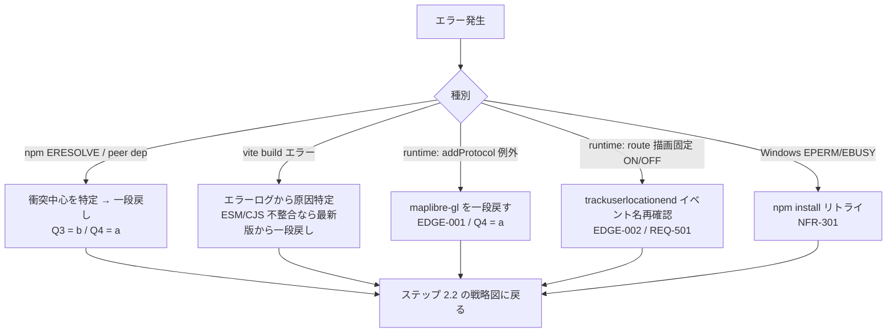

---

## 6. 検証フロー（受け入れ基準への対応） 🔵

**信頼性**: 🔵 *受け入れ基準 acceptance-criteria.md のテスト実施計画 Phase 1-3 より*

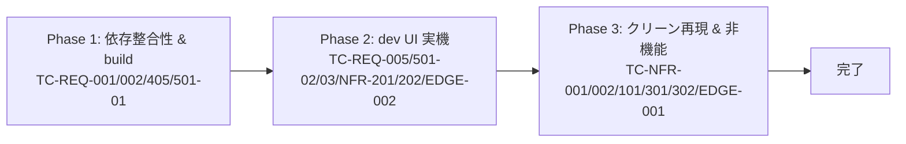

---

## 関連文書

- **アーキテクチャ**: [architecture.md](architecture.md)
- **設計ヒアリング**: [design-interview.md](design-interview.md)
- **要件定義**: [requirements.md](../../spec/library-version-upgrade/requirements.md)
- **受け入れ基準**: [acceptance-criteria.md](../../spec/library-version-upgrade/acceptance-criteria.md)

## 信頼性レベルサマリー

- 🔵 青信号: 8 件 (89%)
- 🟡 黄信号: 1 件 (11%)
- 🔴 赤信号: 0 件 (0%)

**品質評価**: 高品質（変更フロー 3 件・既存フロー参照は既存コードと要件から直接派生。残る 🟡 はエラーハンドリングフローの「種別ごとの対応分岐の網羅性」に限定）
